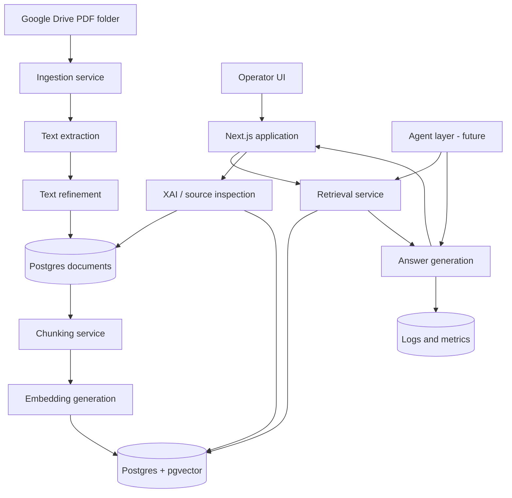

# AIA Insight - Project Scope and Architecture

**Status:** Draft
**Last Updated:** 2026-04-17

This document is the canonical project-scope and architecture reference for AIA Insight. It is intentionally incomplete: some decisions are still open and will be refined as the project moves from specs to implementation.

---

## 1. Product Context

**Vision:** An intelligent document exploration platform that enables querying an initial corpus of 31 scientific papers on applications of ML/DL/remote sensing to Environmental Impact Assessment (EIA), with answers that are **traceable, explainable, and governed**.

**For:** Technical analysts and managers within Petrobras interested in presenting a DEMO/POC of the potential of RAG + Agents + XAI + Governance for the EIA domain.

**Solves:** Manually reading and comparing a dense technical corpus is slow and non-traceable. Answers generated by "black-box" LLMs lack credibility in corporate contexts. This project demonstrates a path in which every answer is accompanied by **auditable sources, passages, and reasoning**.

---

## 2. Goals

- **G1 - End-to-end functional DEMO:** ingestion -> chunking -> multi-doc RAG -> single-doc RAG -> answer with inspectable citations, running on Vercel + Neon.
- **G2 - Full traceability:** 100% of answers linked to source documents, chunks used, and the pipeline version that produced them.
- **G3 - Quality via TDD:** every layer (ingestion, refinement, chunking, retrieval, generation) shipped with tests written before the implementation. Initial target: >80% coverage on core modules.
- **G4 - Pattern-driven extensibility:** architecture designed in layers and with design patterns (Strategy for extractors/refiners, Repository for persistence, State Machine for document status) so that implementations can be swapped without rewrites.

---

## 3. Scope

### v1 DEMO Includes

- **Phase 1 - Document Ingestion:** PDFs in a fixed Drive folder -> governed record in Postgres -> extracted `raw_text` -> generated `refined_text` -> `processed` status, ready for chunking.
- **Phase 2 - Chunking + Embeddings:** strategic chunking over `refined_text`, embedding generation, persistence in pgvector.
- **Phase 3 - Global RAG:** questions over the whole corpus with source returns.
- **Phase 4 - Focused RAG:** questions scoped to a specific document.
- **Phase 5 - Minimal XAI:** every answer surfaces the documents, chunks, and scores used.
- **Phase 6 - Basic Observability:** logging of questions, answers, tokens, cost, and latency.
- **Phase 7 - Pilot Agent:** a simple agent, such as summarization or cross-paper comparison, as a proof of the agentic architecture.

### Explicitly Out of Scope for the DEMO

- End-user authentication, multi-tenancy, and RBAC. Access is restricted to the DEMO operator.
- Automatic duplicate handling. Duplicate control is manual in v1.
- Automatic DOI lookup or automatic extraction of bibliographic metadata.
- Per-user OAuth on Google Drive. The system uses a Service Account and a fixed folder.
- Manual PDF upload through the UI.
- Support for non-PDF formats.
- Internationalization. The UI is expected to be in Portuguese.

---

## 4. Constraints

- **Timeline:** the project is in organization/specs stage. Implementation begins after specs are approved. No hard deadline, but the priority is to ship a working Phase 1 with tests before moving forward.
- **TDD is critical:** no business-logic module lands in the repository without tests written *before* the implementation. Pure infrastructure glue may be covered by integration tests.
- **Design patterns are explicit but pragmatic:** every architectural decision must be justifiable by a known pattern or a documented reason. Over-engineering with patterns is rejected just as strongly as unstructured code.
- **Governance from day 1:** even in DEMO form, every processed document carries governance fields: internal id, hash, origin, logical version, timestamps, and status.
- **Target deployment is Vercel + Neon:** architectural choices must respect those platforms' constraints.

---

## 5. Architectural Intent

AIA Insight is an intelligent document exploration platform for an initial corpus of 31 scientific papers related to Environmental Impact Assessment (EIA).

The architecture must support:

- governed ingestion of PDF documents;
- traceable document processing from source file to usable text;
- retrieval-augmented question answering over one or many documents;
- inspectable answers with sources, retrieved passages, and scores;
- later expansion into agentic workflows without rewriting the base RAG system.

The central architectural constraint is that generated answers must be explainable and auditable. The system should never treat retrieval, generation, or data processing as invisible black boxes.

---

## 6. High-Level Shape

The system is organized around a few stable layers:

- **Interface layer:** operator-facing UI and API routes.
- **Application layer:** use cases such as sync, reprocess, retrieve, answer, and inspect sources.
- **Domain layer:** document status rules, chunking decisions, and governance invariants.
- **Infrastructure layer:** Google Drive, Postgres, pgvector, LLM providers, embeddings, and deployment concerns.
- **Observability and XAI layer:** logs, costs, latency, source inspection, retrieved chunks, and answer traceability.

---

## 7. Runtime Topology

The intended v1 deployment target is:

- **Application:** Next.js 15 on Vercel.
- **Frontend:** React 19 through Next.js App Router.
- **Language:** TypeScript 5.x in strict mode.
- **Database:** Neon Postgres with `pgvector`.
- **ORM:** Drizzle ORM.
- **Document source:** fixed Google Drive folder accessed through a Service Account.
- **Validation:** Zod at runtime boundaries, with inferred TypeScript types where useful.
- **LLM and embeddings:** Vercel AI SDK as the provider abstraction.
- **Tests:** Vitest, with unit tests for business logic and integration tests for database-facing flows.

Open runtime decisions:

- PDF extraction library: `unpdf`, `pdf-parse`, or `pdfjs-dist`.
- Whether ingestion runs synchronously through an API route, through a CLI, through a scheduled job, or through a queue.
- Whether long-running processing needs a background-job provider such as Inngest, Trigger.dev, or QStash.
- Whether original PDFs are always re-downloaded from Drive or cached in object storage.

Until those decisions are finalized, implementation should keep ingestion orchestration behind an application service interface instead of coupling it directly to a specific runtime trigger.

---

## 8. Core Data Flow

### Phase 1: Document Ingestion

1. The operator places a PDF in the fixed Google Drive folder.
2. The system detects or consumes the file through an explicit sync trigger.
3. A governed document record is created in Postgres with status `pending`.
4. The PDF text is extracted and stored as `raw_text`.
5. The text is cleaned or refined and stored as `refined_text`.
6. The document is marked as `processed` if extraction and refinement succeed.
7. The document is marked as `failed` if any critical step fails.

The original PDF remains in Google Drive. Postgres stores the governed metadata and processed text needed by later phases.

### Phase 2: Chunking and Embeddings

1. The system reads only documents with status `processed`.
2. Chunking runs over `refined_text`, not `raw_text`.
3. Each chunk is stored with document id, chunk index, logical document version, and chunk metadata.
4. Embeddings are generated for each chunk.
5. Embeddings are persisted in Postgres using `pgvector`.

Chunking strategy is still open and should be decided before Phase 2 implementation.

### Phase 3 and 4: RAG

The retrieval layer supports two modes:

- **Global RAG:** search across the full processed corpus.
- **Focused RAG:** search restricted to one selected document.

Both modes should return enough metadata to explain the answer:

- source document;
- retrieved chunk;
- score;
- document version;
- prompt/model version when applicable.

### Phase 5 and 6: XAI and Observability

Every generated answer should be stored or logged with:

- question;
- answer;
- source documents;
- chunks used;
- retrieval scores;
- model name;
- prompt version;
- token usage;
- estimated cost;
- latency.

The exact storage schema for logs and traces is not yet finalized.

### Phase 7: Agents

Agents are intentionally deferred. The base system should expose retrieval and generation through interfaces that an agent layer can reuse later.

Potential pilot agent tasks:

- document summarization;
- cross-paper comparison;
- theme extraction;
- report generation.

The agent framework decision is open until milestone M4.

---

## 9. Main Components

### Next.js Application

Responsibilities:

- expose operator UI;
- expose API routes for ingestion, documents, retrieval, and answers;
- validate all request and response boundaries with Zod;
- call application services rather than embedding business logic directly in route handlers.

### Ingestion Service

Responsibilities:

- list PDFs from the fixed Google Drive folder;
- create governed document records;
- coordinate extraction and refinement;
- enforce status transitions;
- isolate per-document failures;
- return sync reports.

### Document Repository

Responsibilities:

- persist document records;
- preserve governance fields;
- expose read/write methods for document lifecycle operations;
- prevent accidental mutation of immutable fields through metadata-edit flows.

### Text Extractor

Responsibilities:

- receive a PDF file or stream;
- extract textual content into `raw_text`;
- classify known failures such as protected PDFs or empty extraction.

Decision still open: `unpdf`, `pdf-parse`, or `pdfjs-dist`.

### Text Refiner

Responsibilities:

- transform `raw_text` into `refined_text`;
- preserve semantic meaning while removing extraction noise;
- fail clearly when usable refined text cannot be produced.

Decision still open: deterministic rules, LLM-assisted refinement, or a hybrid approach.

### Chunking Service

Responsibilities:

- split `refined_text` into retrieval-ready chunks;
- keep stable chunk indexes;
- preserve document and version metadata;
- support future reprocessing/versioning.

### Embedding Service

Responsibilities:

- generate embeddings for chunks;
- abstract the provider through the Vercel AI SDK where possible;
- keep embedding model information traceable.

### Retrieval Service

Responsibilities:

- query pgvector;
- support global and focused retrieval;
- return chunks with scores and source metadata;
- avoid hiding retrieval behavior from the XAI layer.

### Generation Service

Responsibilities:

- assemble retrieved context;
- call the selected LLM provider;
- return the answer and trace metadata;
- record model and prompt versions.

### Observability Service

Responsibilities:

- log questions and answers;
- record tokens, cost, latency, model, and prompt versions;
- make answer behavior inspectable during the DEMO.

---

## 10. Governance Model

Each document must carry a minimum governance baseline:

- internal document id;
- title derived from the Drive file name at insertion time;
- Drive file id;
- origin;
- file hash;
- logical version;
- processing status;
- creation timestamp;
- update timestamp;
- optional bibliographic metadata;
- last error when processing fails.

Governance rules:

- The file hash is stored for traceability, but it is not a unique constraint in v1.
- DOI, authors, publication year, and notes are manually edited metadata.
- The initial title may be edited later by the operator.
- Processed documents must have both `raw_text` and `refined_text`.
- Chunking must use `refined_text`.

---

## 11. Architectural Patterns

The project should use patterns where they reduce real complexity:

- **Repository:** isolate persistence details from application services.
- **Strategy:** allow extractor, refiner, chunker, embedding provider, and generation provider implementations to be swapped.
- **State Machine:** centralize valid document status transitions.
- **Adapter:** wrap external systems such as Google Drive, LLM providers, and database clients.
- **Application Service / Use Case:** coordinate workflows such as sync and reprocess without leaking orchestration into UI code.

Patterns are not goals by themselves. They should be introduced where the code has a clear variation point or lifecycle rule.

---

## 12. Testing Architecture

The testing strategy follows the TDD constraint described in this document.

Expected coverage:

- unit tests for state machine rules;
- unit tests for text refinement behavior;
- unit tests for extractor/refiner error classification;
- repository tests against a real or test Postgres database;
- integration test for Phase 1 ingestion with Drive mocked and Postgres real;
- later retrieval tests against pgvector.

Business logic should not be merged without tests. Infrastructure glue may be covered through integration tests when isolated unit tests would add little value.

---

## 13. Open Decisions

These decisions are intentionally left open:

- PDF extraction library.
- Text refinement strategy.
- Chunking strategy.
- Embedding model.
- LLM provider and model.
- Ingestion trigger: endpoint, CLI, cron, queue, or combination.
- Background-job provider, if needed.
- Maximum PDF size.
- Original PDF caching strategy.
- Observability storage schema.
- Agents framework.
- Final project name.

Open decisions should be resolved in `STATE.md` as architecture decisions when enough evidence exists.

---

## 14. Design Guardrails

- Keep every answer traceable to source documents and chunks.
- Keep governance fields separate from user-editable bibliographic metadata.
- Keep provider-specific APIs behind interfaces.
- Prefer boring, testable TypeScript services over framework-heavy abstractions.
- Do not make the agents layer a dependency of the base RAG flow.
- Do not allow chunking or retrieval over documents that are not `processed`.
- Treat failures as first-class states, not as invisible logs.
