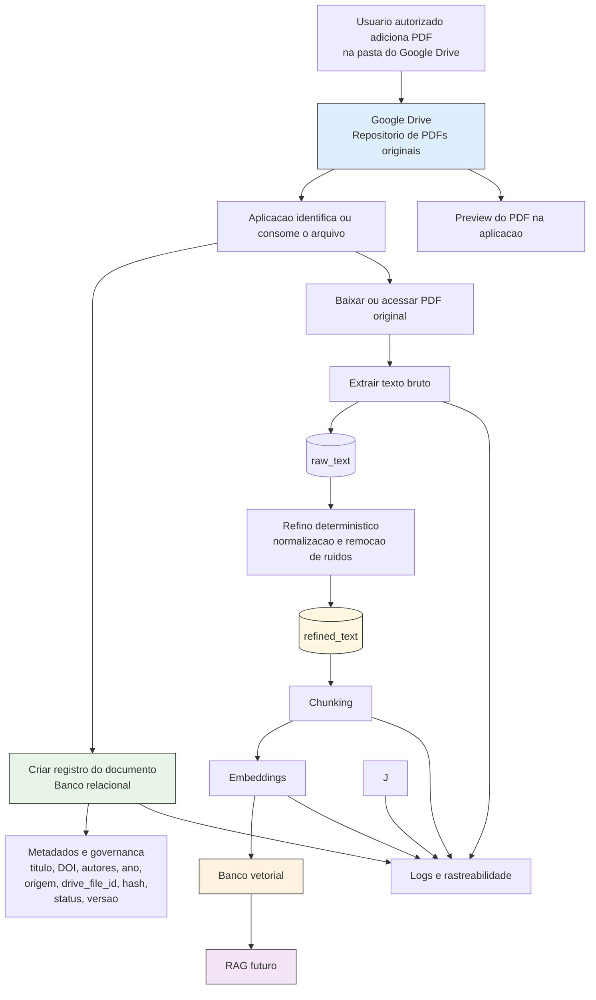

# AIA Insight

Plataforma inteligente de exploração documental com RAG, agentes, explicabilidade e governança de dados, pensada como uma DEMO/POC interna para consulta a um corpus inicial de 31 artigos científicos sobre aplicações de ML, DL e sensoriamento remoto em Avaliação de Impacto Ambiental.

O objetivo do projeto é permitir perguntas sobre um conjunto de documentos, ou sobre um documento específico, com respostas acompanhadas de fontes, trechos recuperados, rastreabilidade e informações de governança.

## Status

O projeto ainda está em fase de organização e especificação. A prioridade atual é implementar a base da Fase 1: ingestão documental assíncrona a partir de uma pasta fixa do Google Drive, registro governado em banco relacional, extração de texto bruto, geração determinística de texto refinado e preparação para chunking.

As decisões de ingestão da Fase 1 estão registradas em `.specs/features/F-01-document-ingestion/spec.md`: `unpdf` para extração de PDF, refino determinístico, execução em background com Inngest e limite inicial de 3 novos documentos por execução. Ainda ficam abertas decisões de fases futuras, como chunking, embeddings e modelo LLM.

## Fluxo Proposto



## Escopo da v1

- **Fase 1 - Ingestão documental:** PDFs em uma pasta fixa do Google Drive, registro governado em Postgres, `raw_text`, `refined_text` e status `processed`.
- **Fase 2 - Chunking e embeddings:** divisão do `refined_text` em chunks estratégicos e persistência de embeddings em pgvector.
- **Fase 3 - RAG global:** perguntas sobre todo o corpus.
- **Fase 4 - RAG focado:** perguntas restritas a um documento específico.
- **Fase 5 - XAI mínimo:** exibição de documentos, chunks e scores usados.
- **Fase 6 - Observabilidade básica:** logs de perguntas, respostas, tokens, custo e latência.
- **Fase 7 - Agente piloto:** primeira tarefa agêntica simples, como sumarização ou comparação entre artigos.

## Princípios

- Toda resposta deve ser rastreável até documentos e chunks.
- O documento original permanece preservado no Google Drive.
- O sistema registra metadados de governança desde a ingestão.
- O chunking deve usar `refined_text`, não `raw_text`.
- Falhas são estados explícitos do pipeline, não apenas logs invisíveis.
- Bibliografia complementar, como DOI, autores e ano, é preenchida manualmente na v1.

## Stack Prevista

- Next.js 15 com App Router
- React 19
- TypeScript em modo strict
- PostgreSQL com extensão `pgvector`
- Drizzle ORM
- Vercel para aplicação
- Neon para Postgres serverless
- Zod para validação
- Vitest para testes
- Vercel AI SDK para LLMs e embeddings
- Google Drive via Service Account

## Setup Local

Requisitos:

- Node.js 22 ou superior
- pnpm 9.15.4
- Docker e Docker Compose

Comandos principais:

```bash
pnpm install
pnpm dev
```

`pnpm dev` (ou `npm run dev`) sobe o Postgres local com Docker Compose,
aguarda o banco responder via `pg_isready`, aplica as migrações Drizzle e
inicia o servidor Next.js.

Checks de desenvolvimento:

```bash
pnpm lint
pnpm typecheck
pnpm test
pnpm build
```

`pnpm test` usa `TEST_DATABASE_URL` e recusa executar os testes destrutivos de
repositório se o nome do banco não contiver `test` como segmento. Na
configuração local padrão, o banco de teste é `aia_insight_test`.

Padrão de commits:

```bash
git commit -m "feat: adicionar ingestao de documentos"
git commit -m "fix: corrigir validacao do banco"
git commit -m "docs: atualizar setup local"
```

As mensagens seguem Conventional Commits e são validadas pelo Husky no hook
`commit-msg`.

O Postgres local usa `pgvector/pgvector:pg17` e fica disponível em
`localhost:5432`, com a URL padrão documentada em `.env.example`.

## Documentação do Projeto

- `.specs/project/ARCHITECTURE.md` - escopo canônico, arquitetura, fluxo de dados, componentes e decisões abertas.
- `.specs/project/ROADMAP.md` - milestones e sequência planejada de entrega.
- `.specs/project/STATE.md` - decisões arquiteturais, bloqueios, ideias adiadas e TODOs.
- `.specs/project/CHANGELOG.md` - histórico das alterações nas specs.
- `.specs/features/F-01-document-ingestion/spec.md` - contrato ativo da Fase 1 de ingestão documental.
- `.specs/features/F-01-document-ingestion/*.md` - blocos pequenos de execução da F-01.
- `.specs/features/F-0X-document-ingestion/spec.md` - especificação histórica de ingestão, depreciada.
- `phase1_pipeline_rules.md` - regras operacionais da pipeline da Fase 1.

## Assets Locais

- `assets/pdfs/article-example.pdf` - artigo PDF de exemplo para testes locais de extração, refino, integração e experimentos com modelos. Não é parte do corpus governado em produção; use como fixture controlada durante desenvolvimento.

Sempre que as specs do projeto forem alteradas, o `CHANGELOG.md` deve ser atualizado com um resumo do que mudou e por que mudou.

## Fora do Escopo da DEMO

- Autenticação de usuários finais, multi-tenancy e RBAC.
- Tratamento automático de duplicidade.
- Busca automática de DOI.
- Extração automática de autores, ano ou metadados bibliográficos.
- OAuth individual por usuário no Google Drive.
- Upload manual de PDF pela UI.
- Suporte a formatos que não sejam PDF.
