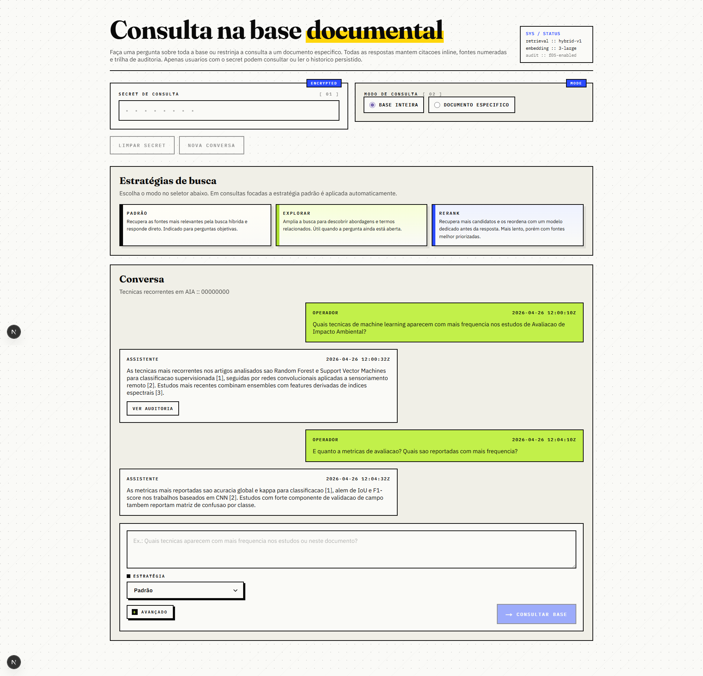
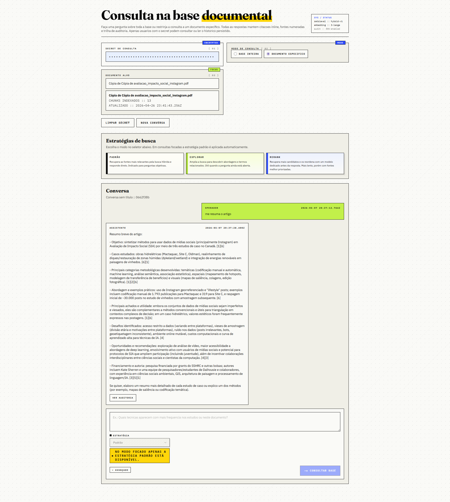
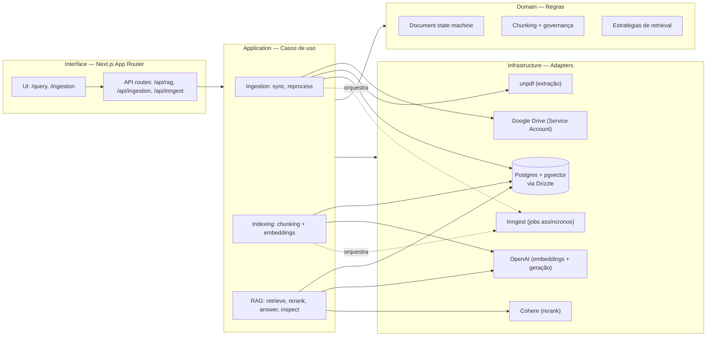
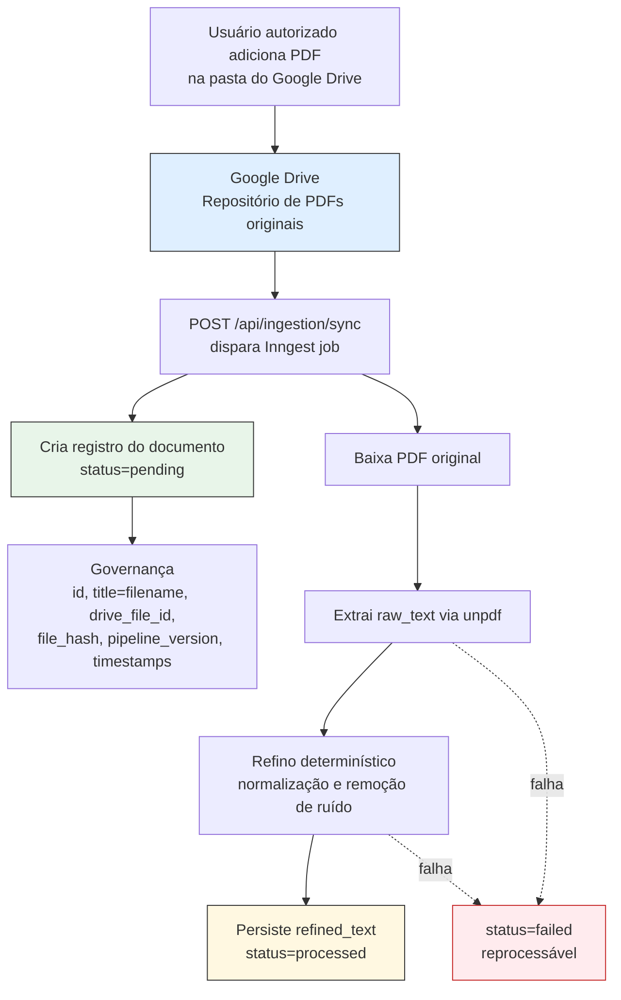
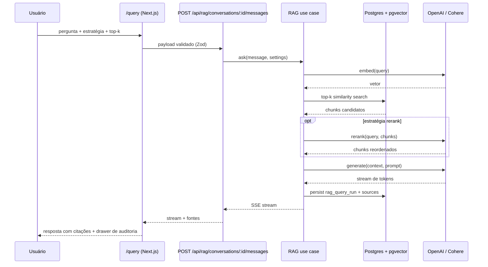

# AIA Insight

> Plataforma RAG governada para exploração de literatura científica sobre Avaliação de Impacto Ambiental.

DEMO/POC interna Petrobras que permite fazer perguntas a um corpus de 31 artigos científicos sobre aplicações de Machine Learning, Deep Learning e sensoriamento remoto em AIA. Toda resposta vem acompanhada de fontes, trechos recuperados, parâmetros usados e rastreabilidade — sem caixa-preta.

**Status:** M1 (ingestão) e M2 baseline (RAG global + focado, controles de query, rastreabilidade, conversa, streaming) entregues. Próximas frentes: rerank (F-08) e camada agêntica (M4).

---

## Por que existe

Pesquisadores e analistas precisam consultar rapidamente um corpus técnico denso, mas não podem confiar em respostas geradas sem trilha de auditoria. AIA Insight responde perguntas sobre o corpus inteiro ou sobre um documento específico, e expõe explicitamente:

- Quais documentos e chunks foram recuperados.
- Quais parâmetros de retrieval foram aplicados (top-k, estratégia, rerank).
- Quanto custou (tokens, latência) e o que foi enviado ao modelo.
- Histórico de perguntas e respostas por conversa, com auditoria por mensagem.

O documento original permanece preservado no Google Drive. O Postgres guarda apenas governança e texto processado.

---

## Demo

A interface principal é o `/query`, onde a pergunta percorre retrieval → rerank (planejado) → geração com citações.



A partir de uma fonte citada, é possível abrir o handoff focado para conversar com um documento específico (`F-09`).



---

## Arquitetura

A aplicação é organizada em quatro camadas com fronteiras explícitas. Route handlers do Next.js validam entrada/saída com Zod e delegam para casos de uso; nenhuma regra de negócio mora na camada de interface.


```mermaid
flowchart LR
    subgraph Interface["Interface — Next.js App Router"]
        UI["UI: /query, /ingestion"]
        API["API routes: /api/rag, /api/ingestion, /api/inngest"]
    end

    subgraph Application["Application — Casos de uso"]
        AppIng["Ingestion: sync, reprocess"]
        AppIdx["Indexing: chunking + embeddings"]
        AppRag["RAG: retrieve, rerank, answer, inspect"]
    end

    subgraph Domain["Domain — Regras"]
        DomDoc["Document state machine"]
        DomChunk["Chunking + governança"]
        DomRag["Estratégias de retrieval"]
    end

    subgraph Infra["Infrastructure — Adapters"]
        Drive["Google Drive (Service Account)"]
        PDF["unpdf (extração)"]
        DB[("Postgres + pgvector<br/>via Drizzle")]
        OpenAI["OpenAI (embeddings + geração)"]
        Cohere["Cohere (rerank)"]
        Inngest["Inngest (jobs assíncronos)"]
    end

    UI --> API
    API --> Application
    Application --> Domain
    Application --> Infra
    AppIng --> Drive
    AppIng --> PDF
    AppIng --> DB
    AppIdx --> DB
    AppIdx --> OpenAI
    AppRag --> DB
    AppRag --> OpenAI
    AppRag --> Cohere
    AppIng -.orquestra.-> Inngest
    AppIdx -.orquestra.-> Inngest
```

---

## Fluxo de Ingestão (M1)

PDFs colocados em uma pasta fixa do Google Drive são ingeridos de forma assíncrona pelo Inngest. Cada documento é registrado com governança antes de qualquer processamento, e falhas são estados explícitos reprocessáveis.


```mermaid
flowchart TD
    A[Usuário autorizado adiciona PDF<br/>na pasta do Google Drive] --> B[Google Drive<br/>Repositório de PDFs originais]
    B --> C[POST /api/ingestion/sync<br/>dispara Inngest job]
    C --> D[Cria registro do documento<br/>status=pending]
    D --> D1[Governança<br/>id, title=filename, drive_file_id,<br/>file_hash, pipeline_version, timestamps]
    C --> E[Baixa PDF original]
    E --> F[Extrai raw_text via unpdf]
    F --> G[Refino determinístico<br/>normalização e remoção de ruído]
    G --> H[Persiste refined_text<br/>status=processed]
    F -.falha.-> X[status=failed<br/>reprocessável]
    G -.falha.-> X

    style B fill:#dfefff,stroke:#333
    style D fill:#e8f5e9,stroke:#333
    style H fill:#fff8e1,stroke:#333
    style X fill:#ffebee,stroke:#c62828
```

Regras operacionais detalhadas em [phase1_pipeline_rules.md](phase1_pipeline_rules.md).

---

## Fluxo de Query (M2)

Uma pergunta percorre embedding → retrieval vetorial → (rerank) → assembly de contexto → geração. A resposta é persistida com fontes, parâmetros aplicados e métricas, permitindo auditoria por mensagem.


```mermaid
flowchart LR
    Q[Pergunta do usuário<br/>em /query] --> S[Seleção de estratégia<br/>global / explore / rerank / focused]
    S --> E[Embedding da query<br/>OpenAI text-embedding-3-large]
    E --> R[Retrieval vetorial<br/>pgvector top-k]
    R --> RR{rerank?}
    RR -->|sim| C[Cohere reranker<br/>2ª passagem]
    RR -->|não| AS
    C --> AS[Context assembly<br/>chunks + metadados]
    AS --> G[Geração<br/>OpenAI com instruções]
    G --> O[Resposta + citações]
    O --> P[Persiste rag_query_run<br/>pergunta, resposta, fontes,<br/>tokens, latência, custo]

    style Q fill:#e3f2fd
    style O fill:#f3e5f5
    style P fill:#fff8e1
```

---

## Sequência de uma resposta com rastreabilidade


```mermaid
sequenceDiagram
    participant U as Usuário
    participant UI as /query (Next.js)
    participant API as POST /api/rag/conversations/:id/messages
    participant App as RAG use case
    participant DB as Postgres + pgvector
    participant LLM as OpenAI / Cohere

    U->>UI: pergunta + estratégia + top-k
    UI->>API: payload validado (Zod)
    API->>App: ask(message, settings)
    App->>LLM: embed(query)
    LLM-->>App: vetor
    App->>DB: top-k similarity search
    DB-->>App: chunks candidatos
    opt estratégia rerank
        App->>LLM: rerank(query, chunks)
        LLM-->>App: chunks reordenados
    end
    App->>LLM: generate(context, prompt)
    LLM-->>App: stream de tokens
    App->>DB: persist rag_query_run + sources
    App-->>API: SSE stream
    API-->>UI: stream + fontes
    UI-->>U: resposta com citações + drawer de auditoria
```

---

## Stack

| Categoria | Tecnologia | Versão | Papel |
|---|---|---|---|
| **Linguagens** | TypeScript | 5.7 | Aplicação inteira em modo strict |
| | SQL | — | Migrations Drizzle, queries vetoriais |
| | Mermaid | — | Diagramas em docs e specs |
| | Bash | — | Scripts de orquestração local |
| **Runtime / UI** | Next.js | 15 | App Router, route handlers, RSC |
| | React | 19 | Interface |
| | Node.js | 22+ | Runtime |
| **Dados** | PostgreSQL | 17 | Banco relacional |
| | pgvector | latest | Índice vetorial |
| | Drizzle ORM | 0.38 | Schema, migrations, queries |
| **IA** | Vercel AI SDK | 6 | Abstração de provedores e streaming |
| | OpenAI (`@ai-sdk/openai`) | 3 | Embeddings (`text-embedding-3-large`) e geração |
| | Cohere reranker | via `ai` | Reranking de candidatos (F-08, planejado) |
| **Integrações** | Google APIs | 171 | Acesso ao Drive via Service Account |
| | unpdf | 1.6 | Extração de texto de PDFs |
| | Inngest | 4 | Orquestração assíncrona de jobs |
| **Qualidade** | Vitest | 2.1 | Testes unitários e integração (TDD) |
| | Zod | 3.24 | Validação em todas as fronteiras |
| | ESLint + Prettier | — | Lint e formatação |
| | Husky + commitlint | — | Conventional Commits no `commit-msg` |
| **Infra (alvo)** | Vercel | — | Deploy da aplicação |
| | Neon | — | Postgres serverless |

---

## Estado das features

| ID | Feature | Status | Spec |
|---|---|---|---|
| F-00 | Health endpoint | ✅ Entregue | [spec](.specs/features/F-00-health-endpoint/spec.md) |
| F-01 | Document Ingestion (M1) | ✅ Entregue | [spec](.specs/features/F-01-document-ingestion/spec.md) |
| F-02 | Chunking + Embeddings | ✅ Entregue | [spec](.specs/features/F-02-chunking-embeddings/spec.md) |
| F-03 | Global RAG | ✅ Entregue | [spec](.specs/features/F-03-global-rag/spec.md) |
| F-04 | Query Controls + Explore | ✅ Entregue | [spec](.specs/features/F-04-query-controls-and-explore/spec.md) |
| F-05 | Answer Traceability | ✅ Entregue | [spec](.specs/features/F-05-answer-traceability/spec.md) |
| F-06 | Conversational Query | ✅ Entregue | [spec](.specs/features/F-06-conversational-query/spec.md) |
| F-07 | Focused RAG | ✅ Entregue | [spec](.specs/features/F-07-focused-rag/spec.md) |
| F-08 | Reranked Retrieval | ⏳ Planejado | [spec](.specs/features/F-08-reranked-retrieval/spec.md) |
| F-09 | Source Card → Focused Handoff | ✅ Entregue | [spec](.specs/features/F-09-source-card-focused-handoff/spec.md) |
| F-10 | Streaming Query UX (SSE) | ✅ Entregue | [spec](.specs/features/F-10-streaming-query-ux/spec.md) |
| F-11 | Agentic Conversational RAG | ⏳ Planejado (M4) | [spec](.specs/features/F-11-agentic-conversational-rag/spec.md) |
| F-12 | Unified Conversational Query | 🚧 Em andamento | [spec](.specs/features/F-12-unified-conversational-query/spec.md) |

Decisões arquiteturais detalhadas em [.specs/project/STATE.md](.specs/project/STATE.md).

---

## Decisões-chave

| AD | Decisão | Por quê |
|---|---|---|
| AD-002 | Drive via Service Account em pasta fixa | Sem OAuth por usuário; modelo de governança centralizado adequado a um corpus interno. |
| AD-004 | Sem tratamento automático de duplicidade | Corpus pequeno e curado manualmente; dedup automático introduziria ambiguidade indesejada na DEMO. |
| AD-005 | DOI, autores e ano editados manualmente | Inferência automática produz erros silenciosos; rastreabilidade exige metadado verificável. |
| AD-006 | PDF extraído com `unpdf` | Biblioteca leve, determinística, sem dependência nativa pesada; suficiente para o corpus alvo. |
| AD-008 | Ingestão assíncrona via Inngest | Desacopla request do trabalho pesado; jobs visíveis em UI, retomáveis e auditáveis. |
| AD-017 | Streaming primeiro no transporte de conversa | SSE em `POST /api/rag/conversations/:id/messages`; `/api/rag/ask` segue JSON-only. |
| AD-018 | Reranker concreto: Cohere | Trade-off explícito de qualidade vs latência; integração via Vercel AI SDK. |
| AD-019 | Aposentadoria do `POST /api/rag/ask` em favor da conversa | Unifica a superfície de query; toda pergunta vive dentro de uma conversa auditável. |
| AD-022 | Auditoria por mensagem inline (drawer) | Substitui o índice global de runs em `/query` por inspeção pontual e contextual. |

---

## Próximas fases

- **F-08 — Reranked Retrieval:** primeira passagem ampla + rerank Cohere antes da geração, exposto como estratégia explícita em `/query`.
- **F-12 — Unified Conversational Query:** consolida composer, painel e estado do `/query` em uma única superfície conversacional.
- **M3 — XAI/observabilidade ampliada:** dashboards de tokens, custo e latência além da auditoria por mensagem.
- **M4 — Camada agêntica (F-11):** primeira tarefa agêntica simples (sumarização, comparação entre artigos), mantida estritamente atrás de uma interface dedicada — nunca como dependência do RAG base.

Roadmap completo em [.specs/project/ROADMAP.md](.specs/project/ROADMAP.md).

---

## Setup local

Requisitos:

- Node.js 22+
- pnpm 9.15.4
- Docker e Docker Compose

Fluxo padrão:

```bash
pnpm install
pnpm dev
```

`pnpm dev` sobe Postgres local via Docker Compose, aguarda o banco com `pg_isready`, aplica migrações Drizzle e inicia o Next.js.

Para trabalhar com ingestão assíncrona local, use o fluxo combinado com Inngest:

```bash
pnpm dev:all
```

`pnpm dev:all` inicia a app (`dev:app`), aguarda `http://localhost:3000/api/inngest` responder, e sobe o Inngest Dev Server apontando pra essa rota. UI do Inngest: `http://localhost:8288`.

Em terminais separados:

```bash
pnpm dev:app      # Postgres + migrações + Next.js
pnpm dev:inngest  # Inngest Dev Server
```

Variáveis úteis:

```bash
PORT=3001 pnpm dev:app
INNGEST_APP_URL="http://localhost:3001/api/inngest" pnpm dev:inngest
APP_READY_TIMEOUT_SECONDS=120 pnpm dev:all
```

Checks de qualidade:

```bash
pnpm lint
pnpm typecheck
pnpm test
pnpm build
```

`pnpm test` usa `TEST_DATABASE_URL` e recusa rodar testes destrutivos de repositório se o nome do banco não contiver `test` como segmento. Padrão local: `aia_insight_test`.

O Postgres local usa `pgvector/pgvector:pg17` em `localhost:5432`, conforme `.env.example`.

---

## Como contribuir

- **Spec-first:** features de milestone começam com discussão e contrato em `.specs/features/F-NN-<slug>/spec.md` antes do código (AD-007).
- **TDD obrigatório** para módulos de regra de negócio: testes antes da implementação. Glue de infraestrutura pode ser coberto por integração.
- **Padrões justificáveis:** decisões arquiteturais devem se ancorar em um padrão conhecido (Repository, Strategy, State Machine, Adapter, Application Service) ou em uma razão documentada como `AD-###` em [.specs/project/STATE.md](.specs/project/STATE.md).
- **Conventional Commits** validados via Husky no hook `commit-msg`.
- **Review independente:** features de milestone exigem uma rodada com um revisor novo (sem o histórico de implementação no contexto), recebendo apenas o spec e o diff.

---

## Documentação

- [.specs/project/ARCHITECTURE.md](.specs/project/ARCHITECTURE.md) — escopo canônico, arquitetura, fluxo de dados e decisões abertas.
- [.specs/project/ROADMAP.md](.specs/project/ROADMAP.md) — milestones e sequência planejada de entrega.
- [.specs/project/STATE.md](.specs/project/STATE.md) — decisões arquiteturais (AD-###), bloqueios, ideias adiadas e TODOs.
- [.specs/project/CHANGELOG.md](.specs/project/CHANGELOG.md) — histórico das alterações nas specs.
- [.specs/features/F-NN-<slug>/spec.md](.specs/features/) — overview e contrato de cada feature.
- [docs/m1-data-foundation-and-ingestion.md](docs/m1-data-foundation-and-ingestion.md) — overview do que M1 entregou em inglês.
- [docs/local-ingestion.md](docs/local-ingestion.md) — guia rápido de ingestão local com Drive + Inngest.
- [phase1_pipeline_rules.md](phase1_pipeline_rules.md) — regras operacionais da Fase 1.
- [CLAUDE.md](CLAUDE.md) — instruções para agentes de IA que trabalham no repositório.

Sempre que as specs forem alteradas, [.specs/project/CHANGELOG.md](.specs/project/CHANGELOG.md) deve ser atualizado com o que mudou e por quê.

---

## Fora do escopo da DEMO

- Autenticação de usuários finais, multi-tenancy e RBAC.
- Tratamento automático de duplicidade.
- Busca automática de DOI ou inferência de autores, ano e metadados bibliográficos.
- OAuth individual por usuário no Google Drive.
- Upload manual de PDF pela UI.
- Suporte a formatos que não sejam PDF.
- I18n: a interface é PT-BR; rotas técnicas como `/ingestion` permanecem em inglês por decisão de feature.
