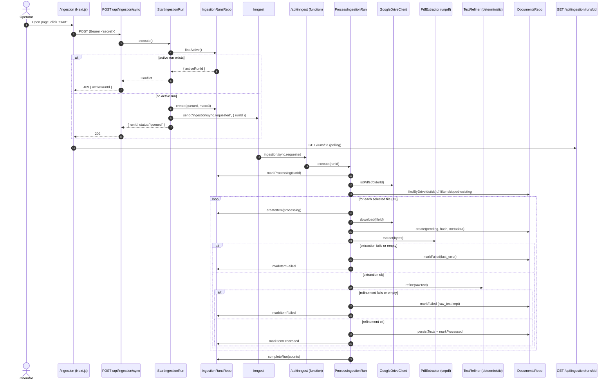

# TDD — F-01 Document Ingestion

| Field           | Value                                                                 |
| --------------- | --------------------------------------------------------------------- |
| Feature ID      | F-01                                                                  |
| Milestone       | M1 — Data Foundation and Ingestion                                    |
| Owner           | @leosanner                                                            |
| Team            | @leosanner                                                            |
| Spec (contract) | [.specs/features/F-01-document-ingestion/spec.md](../../.specs/features/F-01-document-ingestion/spec.md) |
| Related specs   | [ARCHITECTURE.md](../../.specs/project/ARCHITECTURE.md), [phase1_pipeline_rules.md](../../phase1_pipeline_rules.md), [ROADMAP.md](../../.specs/project/ROADMAP.md) |
| Status          | Implemented                                                           |
| Created         | 2026-04-24                                                            |
| Last Updated    | 2026-04-24                                                            |

---

## Context

**AIA Insight** is an internal Petrobras DEMO/POC for a RAG platform over 31 scientific papers on ML/DL/remote sensing applied to Environmental Impact Assessment (EIA). Every answer must be traceable, explainable, and governed.

F-01 is the **entry point of the Phase-1 data pipeline**. It turns PDFs stored in a fixed Google Drive folder into governed Postgres records with extracted and refined text, ready to be chunked and embedded in later features (F-02 onward). Nothing in M1/M2 is useful before F-01 exists: without a governed document with `refined_text`, there is no RAG.

**Domain**: document ingestion and governance — the upstream boundary of the RAG pipeline.

**Stakeholders**:
- **Operator** (internal Petrobras user): triggers ingestion runs and inspects progress.
- **Downstream features** (F-02 chunking/embeddings, F-03 global RAG, F-05 traceability): consume `processed` documents with non-empty `refined_text`.
- **Governance / reviewers**: rely on per-document audit fields (`drive_file_id`, `file_hash`, `pipeline_version`, `status`, `last_error`).

---

## Problem Statement & Motivation

### Problems solved

- **No governed document source existed.** Phase-2 chunking cannot start without traceable documents that carry origin, hash, pipeline version, and a well-defined status machine.
- **The operator had no control surface.** Without a UI/API, ingestion would require direct DB access or ad-hoc scripts, which is unacceptable even for a POC under a governance-first mandate.
- **PDF extraction and text refinement have different failure modes** and must be isolated so one bad PDF does not poison a whole batch.
- **Synchronous ingestion is not viable.** PDF download + extraction for several files exceeds request timeouts in a serverless context (Vercel), so the start call must return immediately while processing continues out-of-band.

### Why now

- F-01 is the first implementable contract in M1 (see [ROADMAP.md](../../.specs/project/ROADMAP.md)). Everything downstream — chunking, embeddings, retrieval, generation, XAI — is blocked on it.
- The spec-first workflow (AD-007 in [STATE.md](../../.specs/project/STATE.md)) requires a ratified contract before coding; F-01's contract was accepted and implementation closed out in `05-integration-and-review.md`.

### Impact of not solving

- **Business**: The DEMO cannot show a traceable question→answer loop over the 31 papers, defeating the POC's purpose.
- **Technical**: Every downstream feature would have to reinvent document governance in-flight, breaking the layered architecture.
- **Users**: No way to onboard or re-onboard papers without developer intervention.

---

## Scope

### ✅ In Scope (F-01)

- Operator-facing `/ingestion` page (English) to start a run and poll its progress.
- `POST /api/ingestion/sync` — bearer-protected run starter; returns a `runId` and enqueues async processing via Inngest.
- `GET /api/ingestion/runs/:id` — run status + per-item progress for polling.
- `/api/inngest` — Inngest serve endpoint hosting the ingestion function.
- Google Drive Service Account adapter against a fixed folder (`GOOGLE_DRIVE_FOLDER_ID`).
- Up to **3 new PDFs per run**; files already ingested (matched by `drive_file_id`) are skipped.
- Governed `documents` row creation (Drive metadata, `file_hash`, `pipeline_version`, timestamps, status).
- PDF extraction via `unpdf` behind a `PdfExtractor` Strategy.
- **Deterministic** text refinement (no LLM) behind a `TextRefiner` Strategy.
- Per-document failure isolation: one failed PDF must not stop the rest of the batch.
- Persistence of run (`ingestion_runs`) and run items (`ingestion_run_items`) for post-return inspection.
- Tests covering domain rules, application orchestration, persistence (real Postgres), API contracts, and the async flow (Drive mocked).

### ❌ Out of Scope (F-01)

- Reprocessing failed documents via UI or endpoint.
- Manual bibliographic editing (DOI, authors, year, notes).
- Document listing outside the ingestion-run progress view.
- Chunking, embeddings, retrieval, generation, XAI, observability, agents.
- Automatic duplicate handling by content hash.
- Automatic DOI lookup or bibliographic inference (from PDF, Drive metadata, or LLMs).
- Manual PDF upload through the UI.
- Non-PDF formats.
- Google Drive webhooks / cron sync / push notifications.
- Application-level PDF size cap.
- Caching original PDFs outside Google Drive.

### 🔮 Future Considerations

- Reprocess endpoint for `failed` documents (deferred, see Decisions in spec).
- Manual bibliographic edit UI (M1 follow-up).
- Richer refinement strategy (LLM-assisted or hybrid) — swappable via the existing Strategy seam.
- Cron/webhook-driven sync once the POC graduates beyond manual operator triggers.

---

## Technical Solution

### Architecture Overview

F-01 lives across the four canonical layers defined in [ARCHITECTURE.md](../../.specs/project/ARCHITECTURE.md):

- **Interface** (Next.js App Router): `/ingestion` page + three API routes. Zod validates every boundary.
- **Application** (use cases): `StartIngestionRun`, `GetIngestionRun`, `ProcessIngestionRun`. Routes delegate here; no business logic in handlers.
- **Domain**: document status state machine, ingestion error codes, deterministic refinement rules.
- **Infrastructure**: Google Drive Service Account client, `unpdf` PDF extractor, Inngest client/function, Drizzle-backed repositories.

**Patterns applied**:
- **Repository** — isolates Postgres access (`documents-repository`, `ingestion-runs-repository`).
- **Strategy** — `PdfExtractor`, `TextRefiner` expose pluggable contracts; `unpdf` and deterministic refiner are default implementations.
- **Adapter** — Google Drive and Inngest behind internal interfaces.
- **State Machine** — document status (`pending → processed | failed`) and run status (`queued → processing → completed | failed`) are enforced in domain, not scattered across services.
- **Application Service** — orchestrates the whole flow, coordinating adapters, strategies, and repositories.

### Architecture Diagram



### Data Flow (narrative)

1. Operator opens `/ingestion` and clicks start.
2. UI calls `POST /api/ingestion/sync` with `Authorization: Bearer <secret>`.
3. Route validates auth (constant-time compare) and empty body; delegates to `StartIngestionRun`.
4. Service checks for an active run (`queued`/`processing`). If one exists → 409 `{ activeRunId }`; else creates a new run (`queued`, `max_documents=3`) and publishes `ingestion/sync.requested`. Returns 202 `{ runId, status:"queued", maxDocuments:3 }`.
5. UI polls `GET /api/ingestion/runs/:id` and renders aggregate counts + per-item rows.
6. Inngest delivers the event to `/api/inngest`, which invokes `ProcessIngestionRun`.
7. Service marks run `processing`, lists Drive PDFs, filters files whose `drive_file_id` already exists (counted as `skipped_existing`), picks the first 3 new files in listing order.
8. For each selected file: download → compute `file_hash` → create `pending` document → extract → refine → persist texts → mark `processed`. Any failure after document creation marks only that document + run item `failed` with a safe `last_error`; the next file is attempted.
9. After all items finish, aggregate counts are updated and the run is marked `completed` (even if some items failed). Unrecoverable run-level errors mark the run `failed` without leaking raw provider errors.

### APIs & Contracts

| Method | Route                         | Auth            | Success                                        | Errors                                        |
| ------ | ----------------------------- | --------------- | ---------------------------------------------- | --------------------------------------------- |
| `GET`  | `/ingestion`                  | None (internal) | 200 HTML (English operator page)               | —                                             |
| `POST` | `/api/ingestion/sync`         | Bearer secret   | `202 { runId, status:"queued", maxDocuments }` | `401` no/wrong secret; `409 { activeRunId }` |
| `GET`  | `/api/ingestion/runs/:id`     | None (internal) | `200 <RunDetail>`                              | `404` unknown run                             |
| `*`    | `/api/inngest`                | Inngest signing | Serve endpoint                                  | —                                             |

**Example — POST /api/ingestion/sync (success)**:

```json
// Request: empty body, Authorization: Bearer <INGESTION_SYNC_SECRET>
// Response 202
{
  "runId": "b3b9c2d4-...-...",
  "status": "queued",
  "maxDocuments": 3
}
```

**Example — GET /api/ingestion/runs/:id**:

```json
{
  "run": {
    "id": "b3b9c2d4-...",
    "status": "completed",
    "maxDocuments": 3,
    "counts": {
      "selected": 3,
      "processed": 2,
      "failed": 1,
      "skippedExisting": 4
    },
    "startedAt": "2026-04-24T12:00:03Z",
    "finishedAt": "2026-04-24T12:00:41Z",
    "lastError": null
  },
  "items": [
    { "driveFileId": "1abc...", "title": "paper-12.pdf", "status": "processed", "documentId": "..." },
    { "driveFileId": "1def...", "title": "paper-13.pdf", "status": "processed", "documentId": "..." },
    { "driveFileId": "1ghi...", "title": "paper-14.pdf", "status": "failed",    "documentId": "...", "lastError": "refined_text_empty" }
  ]
}
```

All responses pass a Zod schema before serialization and **must not** contain: DB URLs, Service Account private keys, operator secrets, raw Drive/Inngest errors, or stack traces.

### Database Schema

**Existing `documents`** (from [src/db/schema.ts](../../src/db/schema.ts)) — F-01 uses only statuses `pending`, `processed`, `failed`. Bibliographic fields (`doi`, `authors`, `publication_year`, `notes`) stay nullable; never auto-filled.

**New `ingestion_runs`**:

| Field                    | Type       | Notes                                            |
| ------------------------ | ---------- | ------------------------------------------------ |
| `id`                     | uuid PK    |                                                  |
| `status`                 | enum       | `queued` \| `processing` \| `completed` \| `failed` |
| `max_documents`          | int        | Fixed to 3 in F-01                               |
| `selected_count`         | int        | Aggregate, updated at finish                     |
| `processed_count`        | int        |                                                  |
| `failed_count`           | int        |                                                  |
| `skipped_existing_count` | int        |                                                  |
| `last_error`             | text?      | Safe, non-leaking code                           |
| `created_at`             | timestamptz|                                                  |
| `started_at`             | timestamptz|                                                  |
| `finished_at`            | timestamptz|                                                  |
| `updated_at`             | timestamptz|                                                  |

Index: partial unique on `status IN ('queued','processing')` to enforce single active run at the DB layer (defense in depth for the application-level check).

**New `ingestion_run_items`**:

| Field           | Type    | Notes                                                              |
| --------------- | ------- | ------------------------------------------------------------------ |
| `id`            | uuid PK |                                                                    |
| `run_id`        | uuid FK | → `ingestion_runs.id`                                              |
| `drive_file_id` | text    | Drive identifier                                                   |
| `document_id`   | uuid?   | Nullable — null when failure happened before document creation     |
| `title`         | text    | Drive filename captured at selection time                          |
| `status`        | enum    | `processing` \| `processed` \| `failed`                            |
| `last_error`    | text?   | Safe error code                                                    |
| `created_at`    | ts      |                                                                    |
| `updated_at`    | ts      |                                                                    |

Skipped-existing files are counted on the run and **do not** produce item rows.

### Key Modules

- `src/domain/documents/status.ts` — status transitions and typed errors.
- `src/domain/documents/errors.ts` — safe ingestion error codes.
- `src/domain/text/deterministic-refiner.ts` — rule-based text cleanup (no LLM).
- `src/application/ingestion/start-ingestion-run.ts`
- `src/application/ingestion/get-ingestion-run.ts`
- `src/application/ingestion/process-ingestion-run.ts`
- `src/infrastructure/drive/google-drive-client.ts` — Service Account adapter.
- `src/infrastructure/pdf/unpdf-extractor.ts` — `PdfExtractor` default.
- `src/infrastructure/ingestion/inngest.ts` — Inngest client + function.
- `src/repositories/documents-repository.ts`
- `src/repositories/ingestion-runs-repository.ts`
- `src/app/api/ingestion/sync/route.ts`
- `src/app/api/ingestion/runs/[id]/route.ts`
- `src/app/api/inngest/route.ts`
- `src/app/ingestion/page.tsx`

### Invariants (non-negotiable)

- **INV-01** F-01 never chunks, embeds, retrieves, or generates.
- **INV-02** `raw_text` is never a valid source for Phase-2 chunking; only `processed` docs with `refined_text` are.
- **INV-03** A `processed` document always has non-empty `raw_text` **and** non-empty `refined_text`.
- **INV-04** `failed` documents remain in the database — never silently deleted.
- **INV-05** Bibliographic fields never auto-filled (Drive, PDF, DOI services, LLMs, heuristics).
- **INV-06** Documents matched by `drive_file_id` are not updated by sync — not even title after a Drive rename.
- **INV-07** `file_hash` is governance-only; never used to reject duplicates in F-01.
- **INV-08** At most 3 new PDFs per run.
- **INV-09** No application-defined PDF size cap.
- **INV-10** Secrets and raw provider errors never appear in response bodies.
- **INV-11** Base ingestion flow has no dependency on any agents framework.
- **INV-12** `INGESTION_SYNC_SECRET` never appears in client bundles, responses, logs, or run rows.

---

## Risks

| #  | Risk                                                                     | Impact | Probability | Mitigation                                                                                                                     |
| -- | ------------------------------------------------------------------------ | ------ | ----------- | ------------------------------------------------------------------------------------------------------------------------------ |
| R1 | Google Drive API failure (listing or download)                           | High   | Medium      | Per-file failure isolation; Drive-listing failure marks **run** as failed with generic code; download failure marks the item.  |
| R2 | `unpdf` extraction returns empty or garbled text for scanned/locked PDFs | Medium | Medium      | Empty text classified as `raw_text_empty`; document + item marked `failed` with safe code; run continues.                      |
| R3 | Inngest event loss or duplicate delivery                                 | High   | Low         | Run state in Postgres is the source of truth; idempotent state checks (a run already `processing`/`completed` is a no-op).    |
| R4 | Deterministic refiner over-strips legitimate content (e.g. formulas)     | Medium | Medium      | Isolated unit tests on dehyphenation, whitespace, control-char cleanup; Strategy seam lets us swap implementations per artifact quality without touching orchestration. |
| R5 | `INGESTION_SYNC_SECRET` leak via logs or response bodies                 | High   | Low         | Zod response schemas exclude secret fields; constant-time compare; never log the header value; env-only storage.               |
| R6 | Race condition: two concurrent `POST /sync` create two active runs       | Medium | Low         | Application-level "active run" check + partial unique DB index on `status IN ('queued','processing')`.                         |
| R7 | Very large PDFs exhaust serverless memory during extraction              | Medium | Medium      | Accepted trade-off (INV-09); failure surfaces as a failed item with a safe error code; revisit size cap post-POC if needed.    |
| R8 | Per-doc failure aggregation drifts from actual item states               | Medium | Low         | Aggregate counts computed from `ingestion_run_items` at run finalization; integration test covers mixed-outcome runs.          |

---

## Implementation Plan

F-01 was delivered in **five blocks** matching the five detail specs under `.specs/features/F-01-document-ingestion/`. Order reflects dependency: domain → persistence → infrastructure → interface → integration.

| Block | Spec                                  | Scope                                                                                 | Status |
| ----- | ------------------------------------- | ------------------------------------------------------------------------------------- | ------ |
| 1     | `01-domain-state-and-refinement.md`   | Document status state machine, ingestion error codes, deterministic refiner + tests   | ✅ Done |
| 2     | `02-persistence-runs-and-documents.md`| `ingestion_runs` / `ingestion_run_items` schema + repositories + real-PG tests        | ✅ Done |
| 3     | `03-infrastructure-drive-pdf-inngest.md` | Drive Service Account adapter, `unpdf` extractor, Inngest client + function        | ✅ Done |
| 4     | `04-interface-api-and-page.md`        | `/ingestion` page, `POST /api/ingestion/sync`, `GET /runs/:id`, `/api/inngest`        | ✅ Done |
| 5     | `05-integration-and-review.md`        | End-to-end wiring, Zod response contracts, independent review, closeout               | ✅ Done |

Gate: `pnpm lint`, `pnpm typecheck`, `pnpm test` all pass. Independent review executed per AD-007 (fresh reviewer, diff + spec only).

---

## Security Considerations

### Authentication & Authorization

- **`POST /api/ingestion/sync`**: `Authorization: Bearer <INGESTION_SYNC_SECRET>`. Constant-time comparison; missing/wrong → 401 with no run created and no Inngest event published.
- **`GET /api/ingestion/runs/:id`**: no auth in F-01 — the page is an internal operator surface; deployment is behind the corporate network. Accepted for POC; revisit before any external exposure.
- **`/api/inngest`**: signed by Inngest using `INNGEST_SIGNING_KEY`; unsigned or mis-signed requests are rejected by the Inngest serve handler.
- **Google Drive**: Service Account with read-only scope on the fixed `GOOGLE_DRIVE_FOLDER_ID`. No user OAuth, no token refresh paths.

### Secrets Management

| Secret                                 | Where it lives                | Never appears in                                           |
| -------------------------------------- | ----------------------------- | ---------------------------------------------------------- |
| `INGESTION_SYNC_SECRET`                | Server env only               | Client bundles, response bodies, logs, run rows, run items |
| `GOOGLE_SERVICE_ACCOUNT_PRIVATE_KEY`   | Server env only               | Any response body; any log line                            |
| `GOOGLE_SERVICE_ACCOUNT_EMAIL`         | Server env                    | Client bundles                                             |
| `INNGEST_EVENT_KEY` / `INNGEST_SIGNING_KEY` | Server env only           | Client bundles, logs                                       |
| `DATABASE_URL`                         | Server env only               | Any response body                                          |

Env parsing goes through Zod ([src/env/server.ts](../../src/env/server.ts)); `process.env` is not read elsewhere.

### Data Protection

- **In transit**: HTTPS for Drive API, Inngest, and Postgres (depending on host).
- **At rest**: Postgres stores document text and governance metadata only; original PDFs remain in Drive (INV on governance-only retention in Postgres).
- **PII**: Corpus is public scientific papers — no user PII ingested. Operator identity is not persisted (no login in F-01).

### Response Hygiene

Every API response passes a Zod schema that **excludes** raw provider errors and secret fields. Server-side `console.error` logs do not print secrets or full Drive/Inngest stack traces; only safe codes (`drive_download_failed`, `raw_text_empty`, `refined_text_empty`, etc.) are persisted in `last_error`.

### Compliance

Internal Petrobras POC; no external PII or payment data. No PCI/GDPR/LGPD scope in F-01 beyond general corporate data-handling policy.

---

## Testing Strategy

TDD is mandatory for business-logic modules ([CLAUDE.md](../../CLAUDE.md) project rules).

| Test type           | Scope                                                               | Tooling                 |
| ------------------- | ------------------------------------------------------------------- | ----------------------- |
| **Domain unit**     | Status transitions, error taxonomy, deterministic refiner rules     | Vitest                  |
| **Application unit**| `StartIngestionRun`, `GetIngestionRun`, `ProcessIngestionRun` with fakes for repos/adapters/strategies | Vitest + in-memory fakes |
| **Persistence**     | `documents-repository`, `ingestion-runs-repository` against **real Postgres** | Vitest + pgvector container |
| **API contract**    | Zod request/response schemas, 401/409/404 paths, response hygiene    | Vitest + Next route handlers |
| **Async flow**      | Inngest function invoking `ProcessIngestionRun` end-to-end with Drive mocked and real Postgres | Vitest                  |

### Critical scenarios

- 401 on missing/wrong bearer — no run created, no event published.
- 409 when another run is `queued`/`processing` — returns `activeRunId`, no duplicate enqueue.
- Happy path: 3 new PDFs → 3 `processed` documents, run `completed` with correct counts.
- Skipped-existing: PDFs already present by `drive_file_id` are counted, not reprocessed, not modified (title preserved even after Drive rename).
- Mixed outcome: at least one failing PDF + one success → aggregate counts match item states; failed PDF has safe `last_error`, successful PDF is unaffected.
- Extraction returns empty text → `raw_text_empty`, refinement **not** invoked.
- Refinement returns empty → `refined_text_empty`, `raw_text` preserved, document `failed`.
- Response hygiene: no secret, no DB URL, no raw provider stack trace in any response body.
- Deterministic refiner: whitespace normalization, dehyphenation across line breaks, control-char cleanup, **no semantic expansion**.

### Test data

- Fixture PDFs committed under `src/test/fixtures/` for extractor and refiner tests.
- Drive adapter faked at the interface boundary (no network).
- Real Postgres for persistence tests via `docker compose` (see `pnpm dev`).

---

## Monitoring & Observability

F-01 is a POC; no APM stack yet. Observability is structural (DB + structured logs) rather than platform-managed.

| Signal                          | Source                                             | Action                                                                 |
| ------------------------------- | -------------------------------------------------- | ---------------------------------------------------------------------- |
| Run outcome                     | `ingestion_runs.status` + counts                   | Visible on `/ingestion`; inspectable via SQL                           |
| Per-document failure reason     | `documents.last_error`, `ingestion_run_items.last_error` | Safe taxonomy (`drive_download_failed`, `raw_text_empty`, `refined_text_empty`, …) |
| Active-run contention           | 409 rate on `POST /api/ingestion/sync`             | Operator sees in UI; future dashboard can count                        |
| Server errors                   | Next.js server logs (no secrets)                   | Read via hosting platform logs                                          |
| Inngest function health         | Inngest dashboard                                   | Failures and retries visible per-event                                  |

**What is NOT logged**: secrets, Service Account private key, DB URL, full Drive/Inngest stack traces, request `Authorization` header.

**Phase-2+** is expected to add question/answer logs, tokens/cost/latency, and retrieved-chunks traces ([ARCHITECTURE.md](../../.specs/project/ARCHITECTURE.md) Observability/XAI layer). F-01 purposefully stays minimal.

---

## Rollback Plan

F-01 is non-destructive to downstream state (it only inserts documents and runs). Rollback is operational rather than reversal-heavy.

### Triggers

| Trigger                                                       | Action                                          |
| ------------------------------------------------------------- | ----------------------------------------------- |
| Bearer secret leaked / suspected compromise                    | Rotate `INGESTION_SYNC_SECRET` immediately      |
| Systematic mis-extraction (e.g. `unpdf` regression)           | Stop operator runs; swap `PdfExtractor` via Strategy; re-ingest after fix |
| Wrong Drive folder configured (ingested unintended files)     | Hard delete the affected `documents` + `ingestion_run_items` rows; verify Drive scope |
| Schema migration failure during deploy                         | Roll back migration with Drizzle down migration; redeploy previous build |

### Steps

1. **Stop runs** — the operator simply stops clicking "Start"; there is no cron or webhook in F-01. Any in-flight Inngest run is allowed to finish or is cancelled from the Inngest dashboard.
2. **Roll back code** — redeploy the previous tag on the hosting platform.
3. **Roll back schema** (only if migration was the cause) — apply the corresponding down migration generated by `pnpm db:generate`; verify table shape.
4. **Clean up bad data** if a faulty run ingested undesired rows: delete the `ingestion_runs` + `ingestion_run_items` + associated `documents` rows (all keyed off `run_id` / `drive_file_id`).
5. **Rotate secrets** if compromise is suspected (`INGESTION_SYNC_SECRET`, Service Account key, Inngest keys).
6. **Post-mortem** — record the incident as an AD entry in [STATE.md](../../.specs/project/STATE.md) if the decision changes.

---

## Dependencies

| Dependency                            | Type           | Purpose                                      | Risk  |
| ------------------------------------- | -------------- | -------------------------------------------- | ----- |
| Google Drive API (Service Account)    | External       | PDF source of truth                          | Low   |
| Inngest                               | External       | Async function execution out of the request path | Low   |
| Postgres 17 + pgvector                | Infrastructure | Governance + text storage                    | Low   |
| `inngest` (SDK ^4.2.4)                | Package        | Event + function SDK                         | Low   |
| `unpdf` (^1.6.0)                      | Package        | Default PDF extractor                        | Medium (PDF quirks) |
| `zod` (^3.24.1)                       | Package        | Boundary validation                          | Low   |
| Drizzle ORM                           | Package        | Typed schema + migrations                    | Low   |
| Vitest (^2.1.8)                       | Package        | Test runner                                  | Low   |
| Next.js 15                            | Framework      | App Router interface layer                   | Low   |

**Environment variables**: `DATABASE_URL`, `GOOGLE_DRIVE_FOLDER_ID`, `GOOGLE_SERVICE_ACCOUNT_EMAIL`, `GOOGLE_SERVICE_ACCOUNT_PRIVATE_KEY`, `INGESTION_SYNC_SECRET`, `INNGEST_EVENT_KEY`, `INNGEST_SIGNING_KEY`.

---

## Alternatives Considered

| Decision                                     | Alternatives                                                                                    | Why chosen                                                                                                   |
| -------------------------------------------- | ----------------------------------------------------------------------------------------------- | ------------------------------------------------------------------------------------------------------------ |
| **Inngest** for background processing        | Synchronous API, in-process background task, local CLI, DB-polling worker, Trigger.dev, Upstash QStash | Fits Next.js/Vercel; event-driven with retries; no broader task platform than needed; operator gets immediate response |
| **Bearer shared secret** for sync start      | Full user auth/RBAC, no route protection, IP allowlist only                                     | Minimal friction for operator-triggered POC without building an auth subsystem                                |
| **`/ingestion` page in English**             | API-only status inspection, Portuguese UI, larger document-management UI                        | User explicitly asked for an English operator page; scope stays focused on ingestion only                     |
| **Max 3 new PDFs per run**                   | 1, 5, 10, all                                                                                   | Fast demos/tests while still proving batch behavior and per-doc failure isolation                             |
| **No PDF size cap**                          | 20 MB, 50 MB, 100 MB caps                                                                       | User chose none; failures at runtime are captured by the failure taxonomy without hiding operational reality  |
| **Deterministic refinement**                 | LLM-assisted, hybrid deterministic + LLM fallback                                               | Cheaper, faster, testable, enough for M1; Strategy seam lets us swap later without touching orchestration     |
| **Reprocess deferred**                       | Reprocess failed docs now                                                                       | First contract ships the start-to-processed path; reprocess is a clean follow-up feature                      |
| **`unpdf` as default extractor**             | `pdf-parse`, `pdfjs-dist`, LLM vision, external OCR                                              | Modern, zero-native-deps, Next.js-friendly; swappable via `PdfExtractor` Strategy                             |

---

## Open Questions

| #  | Question                                                                 | Owner      | Status          |
| -- | ------------------------------------------------------------------------ | ---------- | --------------- |
| 1  | Reprocess endpoint for `failed` documents — M1 follow-up or M2?          | @leosanner | 🟡 Deferred      |
| 2  | Minimum viable manual-bibliographic edit UI (DOI, authors, year, notes)   | @leosanner | 🔴 Open          |
| 3  | Should `/ingestion` expose historical runs, or only the latest/active?    | @leosanner | 🔴 Open          |
| 4  | Add a PDF size cap once real corpus sizes are known?                      | @leosanner | 🔴 Open (data-driven) |
| 5  | Move from operator-triggered sync to cron/webhook after POC?              | @leosanner | 🟡 Post-POC      |

See also [STATE.md §Todos](../../.specs/project/STATE.md) for project-level open decisions.

---

## Glossary

| Term                     | Meaning                                                                                   |
| ------------------------ | ----------------------------------------------------------------------------------------- |
| **AIA**                  | Avaliação de Impacto Ambiental — Environmental Impact Assessment                          |
| **Ingestion run**        | A single operator-triggered attempt to pull up to 3 new PDFs from the Drive folder         |
| **Run item**             | Per-selected-file record tracking its processing status                                    |
| **Skipped-existing**     | A Drive PDF whose `drive_file_id` is already present in `documents`; counted but not processed |
| **`raw_text`**           | Text extracted from the PDF as-is by the `PdfExtractor`                                    |
| **`refined_text`**       | Deterministically cleaned-up version of `raw_text` — the only text downstream features use |
| **Pipeline version**     | Monotonic tag stored per document so reprocessing across pipeline changes is traceable     |
| **Service Account**      | Google Cloud identity with read-only access to the fixed Drive folder                      |
| **Deterministic refiner**| Rule-based text cleaner (whitespace, dehyphenation, control chars) — no LLM                |
| **`PdfExtractor` / `TextRefiner`** | Strategy interfaces with swappable implementations                              |

---

## Reviewer Checklist

- [ ] What problem does this feature solve, and for whom? *(see Problem Statement & Motivation)*
- [ ] What is explicitly out of scope? *(see Scope)*
- [ ] Which invariants must hold at all times? *(see Technical Solution → Invariants)*
- [ ] What is the end-to-end flow, and which module owns each step? *(see Data Flow + Key Modules)*
- [ ] What external systems or prerequisite features does it depend on? *(see Dependencies)*
- [ ] How will we know the feature is complete? *(see spec Acceptance Criteria + Testing Strategy)*
- [ ] Which decisions were deliberate, and what was rejected? *(see Alternatives Considered)*

> Independent review must use a **fresh reviewer thread** (CLAUDE.md AD-007): only the feature spec, detail docs, this TDD, and the relevant git diff — never the implementer's conversation context.
