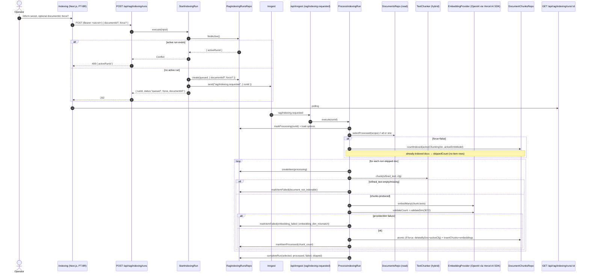

# TDD — F-02 Chunking and Embeddings

| Field           | Value                                                                 |
| --------------- | --------------------------------------------------------------------- |
| Feature ID      | F-02                                                                  |
| Milestone       | M2 — Base RAG                                                         |
| Owner           | @leosanner                                                            |
| Team            | @leosanner                                                            |
| Spec (contract) | [.specs/features/F-02-chunking-embeddings/spec.md](../../.specs/features/F-02-chunking-embeddings/spec.md) |
| Related specs   | [F-01 TDD](F-01-document-ingestion.md), [ARCHITECTURE.md](../../.specs/project/ARCHITECTURE.md), [ROADMAP.md](../../.specs/project/ROADMAP.md) |
| Status          | Implemented                                                           |
| Created         | 2026-04-24                                                            |
| Last Updated    | 2026-04-24                                                            |

---

## Context

F-02 is the **first feature of M2 (Base RAG)** and the direct downstream consumer of F-01. It turns governed, `processed` documents into **retrieval-ready chunks with dense vector embeddings**, stored in Postgres/pgvector. Without F-02, no retrieval, no RAG, no answers.

**Domain**: document indexing — bridging governed text (`refined_text`) to the vector substrate that F-03+ will query.

**Cost context (measured during planning)**: 4 local PDFs were extracted via `unpdf` to estimate tokens — ~74,602 tokens. Extrapolating to 31 articles: ~578,166 tokens → **~US$0.075** with `text-embedding-3-large` at US$0.13/1M tokens. The low absolute cost supports prioritizing retrieval quality for the DEMO (hence 3072-dim embeddings instead of the cheaper 1536-dim small model).

**Stakeholders**:
- **Operator**: triggers indexing runs and inspects progress at `/indexing`.
- **Downstream features** (F-03 global RAG, F-04 query controls, F-05 traceability, F-07 focused RAG): consume chunks + embeddings.
- **Governance**: chunks carry `document_id`, `chunk_index`, `pipeline_version`, `chunking_version`, `embedding_model`, `embedding_dimensions` for traceability.

---

## Problem Statement & Motivation

### Problems solved

- **F-01 output is not retrievable.** `refined_text` is a single blob per document; RAG requires bounded, semantically coherent chunks with vector embeddings.
- **Embedding generation is slow and costly per call.** A synchronous request cannot finish before HTTP timeouts on a 31-paper corpus; it also couples operator UX to provider latency.
- **Model/chunking configuration changes must be safe.** Switching embedding model or chunk size should not silently leave a mixed corpus in the vector table; operators need a deterministic `force` rebuild path.
- **One bad document should not poison a batch.** Provider errors, dimension mismatches, or empty refined text must isolate to one item.
- **Configuration drift risks retrieval correctness.** A chunk without `embedding_model` / `chunking_version` metadata makes retrieval results non-reproducible.

### Why now

- M2 is blocked until F-02 ships. Every subsequent feature (F-03..F-07) reads from `document_chunks`.
- F-01 now produces stable `processed` documents — the upstream contract is frozen.
- Measured cost is negligible → no reason to delay quality.

### Impact of not solving

- **Business**: No DEMO. No retrieval loop, no answers, no traceability.
- **Technical**: Downstream features either duplicate chunking/embedding logic or short-circuit against `refined_text` directly, violating the layered architecture.
- **Operational**: No way to rebuild the corpus when models change, forcing manual SQL surgery.

---

## Scope

### ✅ In Scope (F-02)

- Manual operator-triggered indexing of documents that are already `processed` by F-01.
- Hybrid paragraph-aware chunking over `documents.refined_text` only, with stable `chunk_index`.
- Embedding generation via **Vercel AI SDK + OpenAI provider**, model `text-embedding-3-large` (3072 dims) as M2 default.
- Persistence of chunks + embeddings in Postgres/pgvector (3072-dim column).
- **Idempotent indexing**: skip already-indexed docs by default; `force = true` rebuilds.
- Async orchestration via Inngest (reusing the F-01 pattern); persisted `rag_indexing_runs` + `rag_indexing_run_items`.
- Portuguese operator page at `/indexing` (start run, toggle force, optional single-document target, poll progress).
- Bearer-protected start route — **reuses** `INGESTION_SYNC_SECRET` (no second secret).
- Tests: chunking rules, repositories (real pgvector), embedding adapter boundary, indexing orchestration, API contracts.

### ❌ Out of Scope (F-02)

- Retrieval, answer generation, citations, question UI, RAG response contracts (→ F-03+).
- Focused single-document question behavior (→ F-07).
- Automatic indexing triggered by F-01 completion.
- Full observability: tokens/cost/latency/answer logs (→ M3).
- Reprocessing or modifying F-01 ingestion behavior.
- DOI lookup, bibliographic inference, duplicate-content blocking, metadata editing.
- Supporting multiple embedding dimensions in the same vector table.

### 🔮 Future Considerations

- Automatic post-ingestion indexing once budget governance is in place.
- Section-aware or structure-aware chunking (figures, tables) — the `TextChunker` Strategy seam is ready.
- Alternative embedding providers (Cohere, local) — the `EmbeddingProvider` port is ready.
- Multi-dimension support via a second vector table when/if a model migration requires overlap.

---

## Technical Solution

### Architecture Overview

F-02 extends the four-layer architecture already established by F-01:

- **Interface**: `/indexing` page + `POST /api/rag/indexing/runs` + `GET /api/rag/indexing/runs/:id`; extends `/api/inngest` with the indexing function.
- **Application**: `StartIndexingRun`, `GetIndexingRun`, `ProcessIndexingRun`. Routes delegate; no business logic in handlers.
- **Domain**: hybrid chunker, chunking constants/version, chunk validation, safe error taxonomy.
- **Infrastructure**: OpenAI embedding adapter (Vercel AI SDK), chunks/runs repositories (Drizzle + pgvector), Inngest function.

**Patterns applied**:
- **Repository** — `document-chunks-repository`, `rag-indexing-runs-repository`.
- **Strategy / Port** — `TextChunker` (hybrid default), `EmbeddingProvider` (OpenAI default).
- **Adapter** — Vercel AI SDK OpenAI provider behind `EmbeddingProvider`.
- **State Machine** — run status (`queued → processing → completed | failed`), item status (`processing → processed | failed`).
- **Application Service** — orchestrates selection, chunking, embedding, atomic per-document persistence, failure isolation.

### Architecture Diagram



### Data Flow (narrative)

1. Operator opens `/indexing`, enters the shared secret, optionally picks `documentId` and/or `force`.
2. UI calls `POST /api/rag/indexing/runs` with `Authorization: Bearer <secret>` and body `{ documentId?, force? }`.
3. Route validates body (Zod) and bearer; delegates to `StartIndexingRun`.
4. Service checks for an active run → 409 if any; else creates a `queued` run carrying the options and publishes `rag/indexing.requested`. Returns 202.
5. UI polls `GET /api/rag/indexing/runs/:id`.
6. Inngest delivers the event; `ProcessIndexingRun` marks run `processing` and reloads persisted options.
7. Service selects processed documents in deterministic order (all or the single targeted one). A missing targeted doc → run `failed` with `document_not_indexable`. A targeted `pending`/`failed` doc → a failed item; run still completes safely.
8. If `force = false`, docs already indexed for the active chunking version **and** embedding model go to `skippedCount` without creating item rows.
9. For each non-skipped doc: validate `refined_text` non-empty → hybrid-chunk → embed → validate count + dimensions → atomically `(delete existing under active config if force) + insert chunks + embeddings`.
10. Per-document failures (empty text, chunking error, provider error, dim mismatch, DB error) are recorded on the item with a safe code; the loop continues.
11. On finish, run is `completed` with `selectedCount = processedCount + failedCount + skippedCount`. Unrecoverable run-level errors → run `failed` with safe `last_error`. No response ever leaks provider stack traces, API keys, or DB URLs.

### APIs & Contracts

| Method | Route                              | Auth          | Success                                                        | Errors                                        |
| ------ | ---------------------------------- | ------------- | -------------------------------------------------------------- | --------------------------------------------- |
| `GET`  | `/indexing`                        | Internal      | 200 HTML (PT-BR operator page)                                 | —                                             |
| `POST` | `/api/rag/indexing/runs`           | Bearer secret | `202 { runId, status:"queued", force, documentId? }`           | `400` invalid body; `401` bad/no secret; `409 { activeRunId }` |
| `GET`  | `/api/rag/indexing/runs/:id`       | Internal      | `200 <IndexingRunDetail>`                                      | `404` unknown run                             |
| `*`    | `/api/inngest`                     | Inngest sig   | Serve endpoint                                                  | —                                             |

**Example — POST /api/rag/indexing/runs (whole corpus)**:

```json
// Request
// Authorization: Bearer <INGESTION_SYNC_SECRET>
{}

// Response 202
{
  "runId": "c7a2...",
  "status": "queued",
  "force": false,
  "documentId": null
}
```

**Example — POST with targeted force rebuild**:

```json
{ "documentId": "uuid-of-doc", "force": true }
```

**Example — GET /api/rag/indexing/runs/:id**:

```json
{
  "run": {
    "id": "c7a2...",
    "status": "completed",
    "force": false,
    "documentId": null,
    "counts": { "selected": 31, "processed": 29, "failed": 1, "skipped": 1 },
    "startedAt": "2026-04-24T13:00:05Z",
    "finishedAt": "2026-04-24T13:02:48Z",
    "lastError": null
  },
  "items": [
    { "documentId": "u1", "status": "processed", "chunkCount": 42 },
    { "documentId": "u2", "status": "failed", "chunkCount": 0, "lastError": "document_not_indexable" }
  ]
}
```

All responses pass a Zod schema and exclude credentials, DB URLs, and raw provider errors.

### Database Schema

**New `document_chunks`**:

| Field                      | Type                  | Notes                                                            |
| -------------------------- | --------------------- | ---------------------------------------------------------------- |
| `id`                       | uuid PK               |                                                                  |
| `document_id`              | uuid FK → documents   | Read-only join for retrieval                                     |
| `chunk_index`              | int                   | Stable per (document_id, chunking_version, chunking config)      |
| `content`                  | text                  | Chunk text (never `raw_text`; derived from `refined_text`)       |
| `content_hash`             | text                  | Governance / de-dup diagnostics only                             |
| `estimated_tokens`         | int                   | Chunker's estimate                                               |
| `document_pipeline_version`| text                  | Snapshot of the source document's pipeline version               |
| `chunking_version`         | text                  | Monotonic version of the chunker                                 |
| `embedding_model`          | text                  | E.g. `text-embedding-3-large`                                    |
| `embedding_dimensions`     | int                   | Must be 3072 in M2                                               |
| `embedding`                | vector(3072)          | pgvector column                                                   |
| `created_at` / `updated_at`| timestamptz           |                                                                  |

Indexes: `(document_id, chunk_index)` unique; HNSW/IVFFlat index on `embedding` (chosen by the persistence block — see detail doc `02-persistence-*`).

**New `rag_indexing_runs`**:

| Field            | Type        | Notes                                                               |
| ---------------- | ----------- | ------------------------------------------------------------------- |
| `id`             | uuid PK     |                                                                     |
| `status`         | enum        | `queued` \| `processing` \| `completed` \| `failed`                 |
| `document_id`    | uuid?       | Nullable; set only for targeted single-doc runs                     |
| `force`          | bool        | Persisted run options                                                |
| `selected_count` | int         | Aggregate, finalized on completion                                   |
| `processed_count`| int         |                                                                      |
| `failed_count`   | int         |                                                                      |
| `skipped_count`  | int         |                                                                      |
| `last_error`     | text?       | Safe code                                                            |
| `created_at` / `started_at` / `finished_at` / `updated_at` | timestamptz | |

Partial unique index on `status IN ('queued','processing')` for DB-level single-active-run enforcement.

**New `rag_indexing_run_items`**:

| Field         | Type    | Notes                                         |
| ------------- | ------- | --------------------------------------------- |
| `id`          | uuid PK |                                               |
| `run_id`      | uuid FK | → `rag_indexing_runs.id`                      |
| `document_id` | uuid FK | → `documents.id`                              |
| `status`      | enum    | `processing` \| `processed` \| `failed`       |
| `chunk_count` | int     | 0 for failed items                            |
| `last_error`  | text?   | Safe code                                     |
| `created_at` / `updated_at` | timestamptz | |

Skipped-existing docs **do not** create item rows; they are only counted on the run.

### Key Modules

- `src/domain/chunking/*` — chunking constants, hybrid chunker, chunk validation.
- `src/application/indexing/*` — `StartIndexingRun`, `GetIndexingRun`, `ProcessIndexingRun`, ports, Zod schemas.
- `src/repositories/document-chunks-repository.ts` — chunk + vector persistence, active-config skip/force logic, atomic per-doc replacement.
- `src/repositories/rag-indexing-runs-repository.ts` — run/item lifecycle.
- `src/infrastructure/ai/openai-embedding-provider.ts` — Vercel AI SDK + OpenAI provider adapter.
- `src/app/api/rag/indexing/runs/route.ts` — start.
- `src/app/api/rag/indexing/runs/[id]/route.ts` — polling.
- `src/app/indexing/page.tsx` — PT-BR operator page.
- `src/infrastructure/ingestion/inngest.ts` — extended with the indexing function.

### Invariants (non-negotiable)

- **INV-01** Never create chunks from `raw_text`.
- **INV-02** Never index `pending` or `failed` documents.
- **INV-03** A retrieval-ready chunk always has non-empty content and exactly one 3072-dim embedding.
- **INV-04** Chunk metadata preserves `document_id`, `chunk_index`, `document_pipeline_version`, `chunking_version`, `embedding_model`, `embedding_dimensions`.
- **INV-05** OpenAI / Vercel AI SDK calls stay outside domain and application business rules.
- **INV-06** A failed indexing item never mutates or deletes the source document.
- **INV-07** Responses never leak `OPENAI_API_KEY`, `DATABASE_URL`, `INGESTION_SYNC_SECRET`, or raw provider stack traces.
- **INV-08** F-02 never calls an answer-generation LLM.
- **INV-09** F-02 never depends on any agents framework.

---

## Risks

| #  | Risk                                                                   | Impact | Probability | Mitigation                                                                                                   |
| -- | ---------------------------------------------------------------------- | ------ | ----------- | ------------------------------------------------------------------------------------------------------------ |
| R1 | OpenAI embeddings API outage or 429s                                   | High   | Medium      | Inngest retries at the function level; per-doc failure isolation; safe `embedding_failed` code.              |
| R2 | Provider returns wrong dimension for a subset of inputs                | High   | Low         | Validate count + dim per document **before** persistence; dim mismatch → doc fails with no partial chunks.    |
| R3 | Hybrid chunker produces unstable indexes across runs                   | High   | Low         | `chunking_version` + deterministic paragraph-aware algorithm + unit tests on index stability.                 |
| R4 | Partial writes leave retrieval-ready chunks without embeddings         | High   | Low         | Per-doc atomic persistence (delete-if-force + insert in one transaction); INV-03 enforced at repo layer.      |
| R5 | Unintended corpus rebuild explodes provider cost                       | Medium | Low         | `force` is opt-in and scoped; skip-by-default idempotent path is the operator default; 3072-dim cost measured negligible. |
| R6 | Race on concurrent start requests                                      | Medium | Low         | App-level active-run check + partial unique DB index on `status IN ('queued','processing')`.                  |
| R7 | Secret/API key leaked through response or log                          | High   | Low         | Zod response schemas + structured safe error codes; `OPENAI_API_KEY` never logged; constant-time bearer compare. |
| R8 | Chunker over-splits (tiny chunks) or under-splits (too-long chunks)    | Medium | Medium      | 900/150 estimated-token limits; unit tests on paragraph boundaries, long-paragraph fallback, min-chunk size.   |
| R9 | pgvector dimension change not matching column causes insert failure    | High   | Low         | Single 3072-dim vector column; any model change requires migration + `force` rebuild (INV-03 guards correctness). |

---

## Implementation Plan

F-02 was delivered in five blocks matching the detail specs under `.specs/features/F-02-chunking-embeddings/`.

| Block | Spec                                                 | Scope                                                                                         | Status |
| ----- | ---------------------------------------------------- | --------------------------------------------------------------------------------------------- | ------ |
| 1     | `01-domain-chunking-and-errors.md`                   | Hybrid chunker, chunking version constants, token estimation, safe indexing error codes        | ✅ Done |
| 2     | `02-persistence-chunks-and-indexing-runs.md`         | `document_chunks` (pgvector), `rag_indexing_runs`, `rag_indexing_run_items`, repos, real-PG tests | ✅ Done |
| 3     | `03-application-embedding-and-inngest.md`            | `EmbeddingProvider` port, OpenAI Vercel-AI-SDK adapter, Start/Get/Process services, Inngest fn, env validation | ✅ Done |
| 4     | `04-interface-api-and-page.md`                       | `POST /api/rag/indexing/runs`, `GET …/:id`, Zod schemas, bearer auth, PT-BR `/indexing` page   | ✅ Done |
| 5     | `05-integration-and-review.md`                       | End-to-end validation, spec sync, independent review (fresh thread per AD-007), closeout       | ✅ Done |

Gate: `pnpm lint`, `pnpm typecheck`, `pnpm test`, and `OPENAI_API_KEY=<non-empty> pnpm build` must pass.

---

## Security Considerations

### Authentication & Authorization

- **`POST /api/rag/indexing/runs`**: `Authorization: Bearer <INGESTION_SYNC_SECRET>`. Constant-time compare. Deliberate decision to **reuse** the F-01 secret — one operator, one secret, less config churn, same trust boundary.
- **`GET /api/rag/indexing/runs/:id`**: no auth in F-02; internal operator surface. Accepted for POC; revisit before external exposure.
- **`/api/inngest`**: signed by Inngest via `INNGEST_SIGNING_KEY`.
- **OpenAI**: Vercel AI SDK reads `OPENAI_API_KEY` from server env only; never passed to client.

### Secrets Management

| Secret                       | Where it lives      | Never appears in                                                                 |
| ---------------------------- | ------------------- | -------------------------------------------------------------------------------- |
| `OPENAI_API_KEY`             | Server env only     | Client bundles, response bodies, logs, run rows, run items                       |
| `INGESTION_SYNC_SECRET`      | Server env only     | Client bundles, response bodies, logs                                            |
| `INNGEST_EVENT_KEY` / `INNGEST_SIGNING_KEY` | Server env only | Client bundles, logs                                            |
| `DATABASE_URL`               | Server env only     | Any response body                                                                 |

Env parsing via Zod in [src/env/server.ts](../../src/env/server.ts).

### Data Protection

- **In transit**: HTTPS for OpenAI, Inngest, Postgres (when hosted).
- **At rest**: Postgres stores chunk text + vectors. No PII in the corpus (public scientific papers).
- **Cost guardrail**: `force` defaults to `false`; the skip-by-default idempotent path is the cheap default, so an accidental re-run does not re-embed the corpus.

### Response Hygiene

All responses pass Zod schemas that **omit** provider stack traces and secret fields. The safe indexing error taxonomy (`document_not_indexable`, `embedding_failed`, `embedding_dim_mismatch`, `chunking_failed`, etc.) is the only information surfaced in `last_error` fields.

---

## Testing Strategy

TDD mandatory for business-logic modules (CLAUDE.md).

| Test type              | Scope                                                                          | Tooling                 |
| ---------------------- | ------------------------------------------------------------------------------ | ----------------------- |
| **Domain unit**        | Hybrid chunker: paragraph boundaries, 900/150 limits, stable `chunk_index`, token estimation, long-paragraph fallback, min-chunk | Vitest                  |
| **Application unit**   | `StartIndexingRun` (active-run check, bearer validation), `GetIndexingRun`, `ProcessIndexingRun` (selection, skip/force, failure isolation) with faked repos/ports | Vitest + in-memory fakes |
| **Persistence (real)** | `document-chunks-repository` pgvector round-trip, `(document_id, chunk_index)` uniqueness, atomic delete+insert under `force`; `rag-indexing-runs-repository` lifecycle | Vitest + real Postgres  |
| **Provider adapter**   | OpenAI embedding adapter with mocked Vercel AI SDK response: dimension validation, count validation, error mapping | Vitest                  |
| **API contract**       | Request/response Zod schemas, 400/401/409/404 paths, response hygiene          | Vitest + route handlers  |
| **Async flow**         | Inngest fn → `ProcessIndexingRun` with mocked `EmbeddingProvider`, real Postgres | Vitest                  |

### Critical scenarios

- Happy path: `processed` doc → non-empty chunks → 3072-dim embeddings persisted.
- `pending` / `failed` doc selected → not indexed; targeted version → failed item, run still completes.
- `processed` doc with empty/null `refined_text` → safe failed item (`document_not_indexable`).
- Idempotency: two runs with `force=false` → second run's already-indexed docs go to `skippedCount` with no duplicate chunks.
- `force=true` rebuild: existing chunks for the doc under the active (chunking_version, embedding_model) are atomically replaced.
- Mixed provider failure: one doc's embedding call fails → item `failed` (`embedding_failed`), other docs complete, counts are consistent.
- Dimension mismatch: provider returns a non-3072 vector → item `failed` (`embedding_dim_mismatch`), no chunks persisted for that doc.
- 401 on missing/wrong bearer — no run created, no event published.
- 409 on concurrent starts — returns `activeRunId`, no duplicate enqueue.
- Response hygiene: no `OPENAI_API_KEY`, no DB URL, no raw provider stack trace in any response body.

### Test data

- Synthetic `refined_text` fixtures exercising paragraph boundaries and long paragraphs.
- Deterministic stub `EmbeddingProvider` returning controlled vectors (including intentional dim mismatches).
- Real Postgres with pgvector for persistence tests (via `docker compose`).

---

## Monitoring & Observability

F-02 stays minimal on observability — M3 will add tokens/cost/latency.

| Signal                      | Source                                                           | Action                                              |
| --------------------------- | ---------------------------------------------------------------- | --------------------------------------------------- |
| Run outcome                 | `rag_indexing_runs.status` + counts                              | Visible at `/indexing`; inspectable via SQL         |
| Per-doc failure reason      | `rag_indexing_run_items.last_error` (safe code)                  | Operator reads terminal status                      |
| Active-run contention       | 409 rate on `POST /api/rag/indexing/runs`                        | Surfaced in UI                                      |
| Chunk volume per doc        | `rag_indexing_run_items.chunk_count`                             | Quick sanity check on chunker output                |
| Function health / retries   | Inngest dashboard                                                | Retry visibility without leaking provider errors    |

**Not logged**: `OPENAI_API_KEY`, `INGESTION_SYNC_SECRET`, DB URL, raw Vercel AI SDK / OpenAI stack traces, request `Authorization` header.

---

## Rollback Plan

### Triggers

| Trigger                                                                   | Action                                                       |
| ------------------------------------------------------------------------- | ------------------------------------------------------------ |
| Systematic embedding dimension regression (wrong model wired)              | Rotate config → `force` rebuild entire corpus after fix      |
| Cost spike from accidental `force` on whole corpus                        | Stop future runs; accept the spend (already written); audit cause |
| pgvector schema migration failure                                         | Drizzle down migration + redeploy previous build             |
| Chunker regression (bad `chunk_index` stability)                          | Bump `chunking_version` → `force` rebuild; old chunks remain under previous version until deleted manually |
| Secret leak                                                                | Rotate `INGESTION_SYNC_SECRET` and `OPENAI_API_KEY`          |

### Steps

1. **Stop triggering runs** — operator simply stops; no cron / webhook.
2. **Code rollback** — redeploy previous tag.
3. **Schema rollback** — only if the migration is the root cause; apply down migration.
4. **Data cleanup** — if a bad config polluted `document_chunks`, delete rows matching the bad `(chunking_version, embedding_model)` tuple; then `force` rebuild.
5. **Secret rotation** — rotate and re-deploy; past response bodies already exclude secrets by construction.
6. **Post-mortem** — AD entry in [STATE.md](../../.specs/project/STATE.md) if the decision changes (e.g. embedding model swap).

---

## Dependencies

| Dependency                  | Type           | Purpose                                          | Risk  |
| --------------------------- | -------------- | ------------------------------------------------ | ----- |
| OpenAI API                  | External       | Embedding generation (`text-embedding-3-large`)  | Low   |
| Vercel AI SDK (`ai`, `@ai-sdk/openai`) | Package | Provider boundary for embeddings                 | Low   |
| Inngest                     | External       | Async indexing execution                         | Low   |
| Postgres 17 + pgvector      | Infrastructure | Chunk + vector persistence                        | Low   |
| F-01 Document Ingestion     | Prerequisite   | Source of `processed` documents + `refined_text` | N/A (delivered) |
| Drizzle ORM                 | Package        | Schema + migrations                               | Low   |
| Zod                         | Package        | Boundary validation                               | Low   |
| Next.js 15                  | Framework      | Interface layer                                   | Low   |
| Vitest                      | Package        | Test runner                                       | Low   |

**Environment variables**: `OPENAI_API_KEY` (server), `RAG_EMBEDDING_MODEL` (optional override, default `text-embedding-3-large`), `INGESTION_SYNC_SECRET` (reused), `DATABASE_URL`, `INNGEST_EVENT_KEY`, `INNGEST_SIGNING_KEY`.

---

## Alternatives Considered

| Decision                                                        | Alternatives                                                  | Why chosen                                                                                                    |
| --------------------------------------------------------------- | ------------------------------------------------------------- | ------------------------------------------------------------------------------------------------------------- |
| Split M2 into F-02 + F-03 (+ focused F-07)                      | Single M2 spec; two specs combining global & focused RAG      | Incremental TDD, review, and delivery. Smaller contracts ship and are reviewable.                             |
| **Manual** indexing first                                       | Auto after ingestion; cron/job-only                           | Clearer for a POC; decouples F-01 completion from provider spend.                                             |
| **Inngest** async orchestration                                 | Synchronous request; CLI-only                                 | Reuses F-01 pattern; avoids request timeouts for large PDFs / provider latency.                               |
| Hybrid **paragraph-aware chunking**, 900/150 estimated tokens   | Fixed-size chunking; full semantic section parser             | Testable and respects article paragraphs without building a scientific-section parser.                        |
| `text-embedding-3-large` (3072 dims) as default                 | `text-embedding-3-small` (1536); env-only with no default     | Measured corpus cost (~US$0.075 total) → prioritize retrieval quality.                                        |
| **Skip-by-default**, rebuild via `force`                        | Always rebuild; never rebuild                                 | Default is idempotent and cheap; `force` enables chunking/model changes during development.                   |
| **Reuse `INGESTION_SYNC_SECRET`** for start route               | New `RAG_INDEXING_SECRET`; no route protection                | Same operator, same trust boundary; avoids config churn while protecting a cost-incurring action.             |
| OpenAI behind Vercel AI SDK                                     | Direct `openai` SDK; LangChain                                | Matches the project's chosen generation stack (Vercel AI SDK) and keeps a single provider boundary.           |

---

## Open Questions

| #  | Question                                                                  | Owner      | Status                 |
| -- | ------------------------------------------------------------------------- | ---------- | ---------------------- |
| 1  | Move to auto-indexing post-ingestion once budget governance exists?       | @leosanner | 🟡 Post-POC            |
| 2  | Add section-aware chunking (headings, figures, tables) as a second Strategy? | @leosanner | 🔴 Open (quality-driven) |
| 3  | Multi-dimension support (separate vector table) if we migrate embedding models later? | @leosanner | 🔴 Open (M3+)          |
| 4  | Should `/indexing` expose historical runs, or only latest/active?         | @leosanner | 🔴 Open                |
| 5  | HNSW vs. IVFFlat pgvector index parameters for 31-doc corpus — revisit at retrieval stage (F-03) | @leosanner | 🟡 Revisit             |

See also [STATE.md §Todos](../../.specs/project/STATE.md).

---

## Glossary

| Term                          | Meaning                                                                                                 |
| ----------------------------- | ------------------------------------------------------------------------------------------------------- |
| **Indexing run**              | A single operator-triggered attempt to chunk + embed a scope (whole corpus or one document)             |
| **Indexing run item**         | Per-document record of processing status and chunk count                                                 |
| **Chunk**                     | A contiguous span of `refined_text` sized by the hybrid chunker, with stable `chunk_index`               |
| **`chunking_version`**        | Monotonic tag describing the chunker's algorithm/config; part of the "active configuration" key          |
| **`embedding_model`**         | Provider model name (e.g. `text-embedding-3-large`); part of the active configuration                    |
| **Active configuration**      | `(chunking_version, embedding_model)` tuple used to decide skip vs. force                                |
| **`force`**                   | Opt-in flag that rebuilds existing chunks for the selected scope under the active configuration         |
| **`EmbeddingProvider`**       | Port that embeds chunk texts and validates count + dimensions before persistence                         |
| **`TextChunker`**             | Strategy that turns `refined_text` into stable, bounded chunks                                           |
| **Retrieval-ready chunk**     | Chunk with non-empty content **and** exactly one 3072-dim embedding (INV-03)                             |
| **Skipped-existing**          | Document already indexed under the active configuration; counted in `skippedCount`, no item row created  |

---

## Reviewer Checklist

- [ ] What problem does this feature solve, and for whom? *(see Problem Statement & Motivation)*
- [ ] What is explicitly out of scope? *(see Scope)*
- [ ] Which invariants must hold at all times? *(see Technical Solution → Invariants)*
- [ ] What is the end-to-end flow, and which module owns each step? *(see Data Flow + Key Modules)*
- [ ] What external systems or prerequisite features does it depend on? *(see Dependencies)*
- [ ] How will we know the feature is complete? *(see spec Acceptance Criteria + Testing Strategy)*
- [ ] Which decisions were deliberate, and what was rejected? *(see Alternatives Considered)*

> Independent review must use a **fresh reviewer thread** (CLAUDE.md AD-007): only the feature spec, detail docs, this TDD, and the relevant git diff — never the implementer's conversation context.
