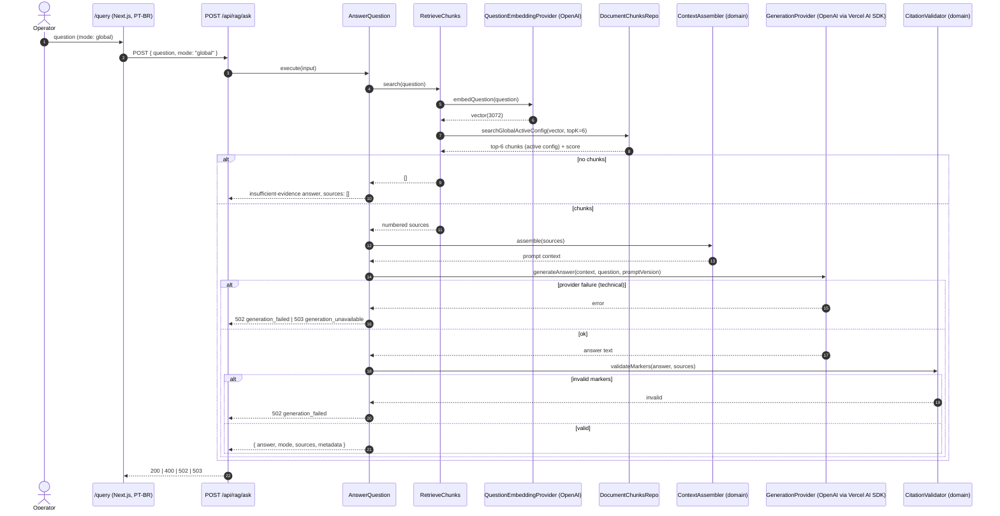

# TDD — F-03 Global RAG

| Field           | Value                                                                 |
| --------------- | --------------------------------------------------------------------- |
| Feature ID      | F-03                                                                  |
| Milestone       | M2 — Base RAG                                                         |
| Owner           | @leosanner                                                            |
| Team            | @leosanner                                                            |
| Spec (contract) | [.specs/features/F-03-global-rag/spec.md](../../.specs/features/F-03-global-rag/spec.md) |
| Related specs   | [F-02 TDD](F-02-chunking-embeddings.md), [ARCHITECTURE.md](../../.specs/project/ARCHITECTURE.md), [ROADMAP.md](../../.specs/project/ROADMAP.md), [query-experience-evolution.md](../../.specs/project/query-experience-evolution.md) |
| Status          | Implemented                                                           |
| Created         | 2026-04-26                                                            |
| Last Updated    | 2026-04-26                                                            |

---

## Context

F-03 is the **first user-visible RAG slice** of M2 and the direct downstream consumer of F-02. It turns a Portuguese question into a **grounded, cited answer** over the entire indexed corpus, using pgvector cosine retrieval and a generation provider behind an interface. F-04..F-07 evolve the same `/query` surface; F-03 establishes its baseline contract.

**Domain**: question answering — bridging retrieval-ready chunks (F-02 output) to a traceable, refusable generated response.

**Stakeholders**:
- **Operator**: asks questions at `/query` and inspects cited sources.
- **Downstream features** (F-04 query controls, F-05 traceability, F-06 conversational query, F-07 focused RAG): build on the `AnswerQuestion` service, the `/api/rag/ask` contract, and the source/citation model.
- **Governance / reviewers**: rely on `sources[]` numbering, inline `[n]` markers, and stable `metadata` (prompt version, models) to audit answers without M3 observability.

---

## Problem Statement & Motivation

### Problems solved

- **F-02 chunks were unreachable.** Embeddings existed in pgvector with no retrieval path, no answer surface, and no citation contract.
- **Answers without citations are unauditable.** A DEMO under a governance-first mandate cannot ship free-text answers with no link back to corpus passages.
- **Mixed indexing configurations would poison answers.** Without an active-config filter, retrieval could return chunks from a previous `chunking_version` or `embedding_model`, breaking score comparability and reproducibility.
- **Provider failures must not leak.** Raw OpenAI/Vercel AI SDK errors, prompts, or stack traces must never reach the response body.
- **Hallucinated citations would defeat the audit trail.** A model can emit `[7]` when only 6 sources exist; the backend must validate markers before serializing.

### Why now

- M2 is gated on a working ask loop. F-04..F-07 all depend on `AnswerQuestion`, the `/api/rag/ask` contract, and the source-numbering model.
- F-02 froze the active-config tuple `(chunking_version, embedding_model)`; F-03 can lock retrieval to it without speculation.
- Cost is bounded: top-k 6 + one generation call per question is well within DEMO budget.

### Impact of not solving

- **Business**: No DEMO. Stakeholders cannot see traceable Q→A over the 31 papers.
- **Technical**: Each downstream feature would re-implement retrieval, prompting, and citation rules, fracturing the layered architecture.
- **Operational**: Manual SQL queries against `document_chunks` would be the only way to validate the corpus.

---

## Scope

### ✅ In Scope (F-03)

- Single-turn global question answering across the full indexed corpus.
- pgvector **cosine** retrieval with **top-k 6**, filtered to the active `(chunking_version, embedding_model)`.
- Question embedding through a `QuestionEmbeddingProvider` port reusing the F-02 active embedding contract.
- Context assembly with **stable source numbering** in retrieval order.
- Generation through a `GenerationProvider` port (Vercel AI SDK + OpenAI provider; model from `RAG_GENERATION_MODEL`).
- **Backend citation validation** before serialization — every `[n]` marker must map to an item in `sources[].sourceNumber`.
- Portuguese answers with inline `[1]`, `[2]`, … markers and a structured numbered source list (`excerpt` carries the full chunk text).
- **Insufficient-evidence refusal**: empty corpus → canonical PT answer with `sources: []`, no provider call; provider-emitted refusal → success with retrieved sources still attached.
- Sanitized HTTP failure shape: `400 invalid_request`, `502 generation_failed`, `503 generation_unavailable` (no `sources`).
- Portuguese `/query` page submitting questions and rendering answer + numbered sources (UI-only excerpt truncation).
- Tests: domain (context assembly, citation validation, answer rules), application (`AnswerQuestion`, `RetrieveChunks`), repository (real pgvector active-config search), provider adapter, route handler, page.

### ❌ Out of Scope (F-03)

- Focused single-document retrieval and document selector UI (→ F-07).
- Query controls (`topK`, strategy), explore/diversification (→ F-04).
- Persisted `query_runs`, traces, related terms, audit endpoints (→ F-05).
- Conversational memory, multi-turn context, conversation persistence (→ F-06).
- Streaming responses, reranking, evaluation, feedback, agents.
- Token/cost/latency observability (→ M3).
- Modifying F-02 chunking, embedding, or indexing logic.
- Manual document metadata editing.

### 🔮 Future Considerations

- Streaming answer rendering once the audit model is stable.
- Reranking strategy as a second port behind `RetrieveChunks`.
- Server-side answer caching keyed by `(question, active_config, prompt_version, generation_model)` once cost matters.

---

## Technical Solution

### Architecture Overview

F-03 extends the four-layer architecture without breaking F-02:

- **Interface**: `/query` page (PT-BR) + `POST /api/rag/ask` route.
- **Application**: `AnswerQuestion` (orchestration), `RetrieveChunks` (embed + search), Zod request/response schemas, prompt constants.
- **Domain**: source numbering / context assembly, citation marker parsing & validation, insufficient-evidence answer rules, safe generation failure classification.
- **Infrastructure**: OpenAI generation adapter (Vercel AI SDK), `document-chunks-repository` extended with active-config global vector search, OpenAI question-embedding adapter (reuses F-02 contract).

**Patterns applied**:
- **Strategy / Port** — `QuestionEmbeddingProvider`, `GenerationProvider`.
- **Repository** — extended `document-chunks-repository` with `searchGlobalActiveConfig(...)`.
- **Application Service** — `AnswerQuestion` orchestrates the entire turn.
- **Adapter** — Vercel AI SDK + OpenAI provider behind both ports.
- **Domain rules** — context assembler + citation validator are pure, framework-free.

### Architecture Diagram



### Data Flow (narrative)

1. Operator opens `/query` and submits a Portuguese question in global mode.
2. UI calls `POST /api/rag/ask` with `{ question, mode: "global" }`.
3. Route validates the body via Zod and delegates to `AnswerQuestion`.
4. `AnswerQuestion` calls `RetrieveChunks`, which embeds the question via `QuestionEmbeddingProvider` (active embedding model, 3072 dims).
5. Repository runs a pgvector cosine query over `document_chunks`, joined with `documents`, filtered to the active `(chunking_version, embedding_model)`, ordered by ascending cosine distance, limited to 6.
6. Score is normalized to `score = 1 - cosine_distance` (higher = better).
7. If retrieval returns zero rows, `AnswerQuestion` returns the canonical PT insufficient-evidence answer with `sources: []` and **never** calls the generation provider.
8. Otherwise, the context assembler assigns `sourceNumber = 1..N` in retrieval order and produces numbered prompt blocks.
9. `GenerationProvider` calls the configured `RAG_GENERATION_MODEL` through the Vercel AI SDK + OpenAI provider, with a prompt that mandates Portuguese, citation discipline, and explicit refusal on insufficient evidence.
10. After generation, the citation validator parses inline `[n]` markers from the answer text. Every marker must map to an existing `sources[].sourceNumber`; when retrieved sources exist and the answer is not a refusal, at least one valid marker must be present.
11. Validation failures (missing, malformed, out-of-range markers) → `502 generation_failed`. Provider technical failures → `502 generation_failed` or `503 generation_unavailable` (transient/unavailable). No `sources` on technical errors.
12. Provider-emitted refusals (model says "no evidence") are normalized to the canonical insufficient-evidence answer; the response remains a `200` with the retrieved `sources` still attached.
13. On success, the response is Zod-validated and serialized: `{ answer, mode, sources, metadata }` with `metadata = { mode, topK, promptVersion, generationModel, embeddingModel }`.
14. `/query` renders the answer plus numbered source list, truncating excerpts visually only — the API payload always returns the full chunk text.

### APIs & Contracts

| Method | Route                  | Auth     | Success                                                                 | Errors                                                                 |
| ------ | ---------------------- | -------- | ----------------------------------------------------------------------- | ---------------------------------------------------------------------- |
| `GET`  | `/query`               | Internal | 200 HTML (PT-BR query page)                                             | —                                                                      |
| `POST` | `/api/rag/ask`         | Internal | `200 { answer, mode, sources[], metadata }`                             | `400 invalid_request`, `502 generation_failed`, `503 generation_unavailable` |

**Example — POST /api/rag/ask (success)**:

```json
// Request
{ "question": "Quais técnicas de DL são aplicadas a sensoriamento remoto?", "mode": "global" }

// Response 200
{
  "answer": "As principais técnicas incluem CNNs para classificação de cobertura do solo [1] e modelos U-Net para segmentação [2]...",
  "mode": "global",
  "sources": [
    {
      "sourceNumber": 1,
      "documentId": "u1",
      "documentTitle": "Deep learning for remote sensing - a review.pdf",
      "chunkId": "c1",
      "chunkIndex": 12,
      "excerpt": "Convolutional neural networks have become the dominant ...",
      "score": 0.842,
      "documentPipelineVersion": "1.0.0",
      "chunkingVersion": "v1",
      "embeddingModel": "text-embedding-3-large"
    }
  ],
  "metadata": {
    "mode": "global",
    "topK": 6,
    "promptVersion": "v1",
    "generationModel": "gpt-4o-mini",
    "embeddingModel": "text-embedding-3-large"
  }
}
```

**Example — empty corpus (no chunks for active config)**:

```json
// Response 200
{
  "answer": "Não encontrei evidência suficiente nos artigos indexados para responder a essa pergunta.",
  "mode": "global",
  "sources": [],
  "metadata": { "mode": "global", "topK": 6, "promptVersion": "v1", "generationModel": "gpt-4o-mini", "embeddingModel": "text-embedding-3-large" }
}
```

**Example — invalid citation marker emitted by the model**:

```json
// Response 502
{ "error": "generation_failed" }
```

All responses are validated by Zod and exclude credentials, DB URLs, prompt internals, and raw provider errors.

### Database Schema

F-03 **adds no tables**. It only extends the F-02 `document-chunks-repository` with a new query:

- `searchGlobalActiveConfig({ embedding, topK, activeChunkingVersion, activeEmbeddingModel })` — pgvector cosine search joined with `documents`, filtered to:
  - `documents.status = 'processed'`
  - `document_chunks.chunking_version = $activeChunkingVersion`
  - `document_chunks.embedding_model = $activeEmbeddingModel`
  - `document_chunks.embedding_dimensions = 3072`
- Ordered by `embedding <=> $queryVec` ascending, limited to `topK = 6`.
- Projects the F-02 chunk metadata plus `documents.title` and `documents.pipeline_version` for the response `sources[]`.

The existing F-02 indexes (per-chunk uniqueness on `(document_id, chunk_index)` and the pgvector ANN index on `embedding`) are sufficient.

### Key Modules

- `src/domain/rag/context-assembler.ts` — pure source numbering and prompt-context assembly.
- `src/domain/rag/citation-markers.ts` — pure marker parser/validator.
- `src/domain/rag/answer-rules.ts` — canonical insufficient-evidence answer + safe generation failure classification.
- `src/application/rag/answer-question.ts` — single-turn orchestration.
- `src/application/rag/retrieve-chunks.ts` — embed + repo search.
- `src/application/rag/ports.ts` — `QuestionEmbeddingProvider`, `GenerationProvider`.
- `src/application/rag/schemas.ts` — Zod request/response/metadata schemas.
- `src/application/rag/constants.ts` — `topK = 6`, `promptVersion = "v1"`, prompt template.
- `src/repositories/document-chunks-repository.ts` — extended with `searchGlobalActiveConfig(...)`.
- `src/infrastructure/ai/openai-generation-provider.ts` — Vercel AI SDK + OpenAI generation adapter.
- `src/infrastructure/ai/openai-question-embedding-provider.ts` — reuses the F-02 embedding contract.
- `src/app/api/rag/ask/route.ts` — Next.js route handler.
- `src/app/query/page.tsx` — Portuguese query UI.

### Invariants (non-negotiable)

- **INV-01** Never retrieve from `documents.raw_text`.
- **INV-02** Never retrieve from non-indexed documents, chunks without embeddings, or chunks outside the active `(chunking_version, embedding_model)`.
- **INV-03** A successful answer never cites a `sourceNumber` absent from the response `sources[]`.
- **INV-04** When sources are retrieved and the answer is not a refusal, the answer contains at least one valid citation marker.
- **INV-05** Successful business responses include `sources`; technical error responses (`502`/`503`) never include `sources`.
- **INV-06** F-03 does not persist questions or answers (M3 owns persistence/observability).
- **INV-07** Responses never expose `OPENAI_API_KEY`, `DATABASE_URL`, raw prompts, or raw provider stack traces.
- **INV-08** Generation stays behind `GenerationProvider`; no agents-framework coupling.
- **INV-09** Empty-corpus path returns the canonical insufficient-evidence answer **without** calling the generation provider.

---

## Risks

| #  | Risk                                                                   | Impact | Probability | Mitigation                                                                                                  |
| -- | ---------------------------------------------------------------------- | ------ | ----------- | ----------------------------------------------------------------------------------------------------------- |
| R1 | Model emits hallucinated citation markers (`[7]` with 6 sources)       | High   | Medium      | Backend `citation-markers` validator runs before serialization; failure → `502 generation_failed`.           |
| R2 | OpenAI generation outage or 429s                                       | High   | Medium      | Provider adapter normalizes errors to `generation_unavailable` (transient) or `generation_failed`; no leakage. |
| R3 | Retrieval mixes old `chunking_version` / `embedding_model` rows        | High   | Low         | Active-config filter applied at the SQL layer; tested against real Postgres with mixed-config fixtures.      |
| R4 | Empty corpus triggers an unnecessary provider call                     | Medium | Low         | `RetrieveChunks` short-circuits to the canonical PT refusal before any provider call (INV-09).               |
| R5 | Provider stack trace, prompt, or `OPENAI_API_KEY` leaks in response    | High   | Low         | Zod response schemas constrain shapes; adapter maps errors to safe codes; structured logging is opt-in.      |
| R6 | Excerpt size blows up payload size                                     | Low    | Medium      | UI truncates visually; payload still carries full chunk text by contract (RF-15) — acceptable for DEMO.     |
| R7 | Provider returns a refusal that the validator misclassifies as success | Medium | Low         | Canonical insufficient-evidence detection in `answer-rules` short-circuits validation and keeps `sources`.   |
| R8 | Cosine score sign / direction confusion                                | Medium | Low         | `score = 1 - cosine_distance` computed in SQL; unit + repo tests assert ordering on synthetic vectors.       |
| R9 | Prompt drift across deploys breaks audit comparability                 | Medium | Low         | `promptVersion` constant + `metadata.promptVersion` in every response; bump on intentional change.           |

---

## Implementation Plan

F-03 was delivered in five blocks matching the detail specs under `.specs/features/F-03-global-rag/`.

| Block | Spec                                                       | Scope                                                                                                  | Status |
| ----- | ---------------------------------------------------------- | ------------------------------------------------------------------------------------------------------ | ------ |
| 1     | `01-domain-context-citations-and-answer-rules.md`          | Pure source numbering, context assembler, citation marker parser/validator, insufficient-evidence rules, safe failure classification | ✅ Done |
| 2     | `02-persistence-global-retrieval.md`                       | `searchGlobalActiveConfig` on `document-chunks-repository`, real-Postgres tests over mixed-config fixtures | ✅ Done |
| 3     | `03-application-retrieval-and-generation.md`               | `AnswerQuestion`, `RetrieveChunks`, ports, Zod schemas, prompt + topK constants, OpenAI generation adapter, env validation | ✅ Done |
| 4     | `04-interface-api-and-page.md`                             | `POST /api/rag/ask` handler, response schemas, safe HTTP status mapping, PT-BR `/query` page          | ✅ Done |
| 5     | `05-integration-and-review.md`                             | End-to-end verification, spec/changelog sync, fresh-thread independent review (AD-007), closeout       | ✅ Done |

Gate: `pnpm lint`, `pnpm typecheck`, `pnpm test`, and `OPENAI_API_KEY=<non-empty> RAG_GENERATION_MODEL=<non-empty> pnpm build` must pass.

---

## Security Considerations

### Authentication & Authorization

- **`POST /api/rag/ask`**: no auth in F-03 — internal operator surface for the DEMO. Accepted; revisit before any external exposure.
- **`/query`**: internal page; no auth in F-03.
- **OpenAI**: `OPENAI_API_KEY` read server-side only via Zod-validated env (`src/env/server.ts`); never reaches the client bundle.
- **Postgres**: `DATABASE_URL` server-only.

### Secrets Management

| Secret                | Where it lives  | Never appears in                                                       |
| --------------------- | --------------- | ---------------------------------------------------------------------- |
| `OPENAI_API_KEY`      | Server env only | Client bundles, response bodies, logs                                  |
| `DATABASE_URL`        | Server env only | Any response body                                                      |
| `RAG_GENERATION_MODEL`| Server env      | Surfaced **only** as `metadata.generationModel` (a stable model name)  |
| `RAG_EMBEDDING_MODEL` | Server env      | Surfaced **only** as `metadata.embeddingModel`                         |

### Data Protection

- **In transit**: HTTPS for OpenAI and Postgres.
- **At rest**: F-03 writes nothing in M2 — no question/answer rows.
- **Prompt hygiene**: prompt template lives in code, never echoed back. Only `promptVersion` is exposed.

### Response Hygiene

All success and error responses pass Zod schemas. Technical failures collapse to `{ error: "invalid_request" | "generation_failed" | "generation_unavailable" }`. No `sources`, no provider stack traces, no DB error text, no raw prompts.

---

## Testing Strategy

TDD mandatory for business-logic modules (CLAUDE.md).

| Test type              | Scope                                                                                                  | Tooling                  |
| ---------------------- | ------------------------------------------------------------------------------------------------------ | ------------------------ |
| **Domain unit**        | Source numbering, context assembly stability, citation marker parsing, marker validity rules, insufficient-evidence rules, safe failure classification | Vitest                   |
| **Application unit**   | `RetrieveChunks` (active-config invocation, empty-result short-circuit), `AnswerQuestion` (no-chunk path, validation failure path, provider failure mapping, success path) | Vitest + in-memory fakes |
| **Persistence (real)** | `searchGlobalActiveConfig` against real Postgres with mixed `(chunking_version, embedding_model)` rows; ordering by cosine distance; score sign | Vitest + real Postgres   |
| **Provider adapter**   | OpenAI generation adapter with mocked Vercel AI SDK: error mapping (`generation_failed` vs `generation_unavailable`), prompt assembly | Vitest                   |
| **API contract**       | `POST /api/rag/ask` request/response Zod, 400/502/503 paths, response hygiene                          | Vitest + route handlers  |
| **UI**                 | `/query` submit, render answer, render numbered sources, visual excerpt truncation                     | Vitest + RTL             |

### Critical scenarios

- Happy path: indexed corpus → top-6 retrieval → generated PT answer with valid `[1]`..`[k]` markers → response includes matching `sources[]` + `metadata`.
- Empty corpus: zero chunks for active config → canonical refusal, `sources: []`, **no provider call**.
- Mixed-config fixtures: only active-config rows are returned; old `chunking_version` / wrong `embedding_model` rows are excluded.
- Provider-emitted refusal: success response with retrieved `sources`, canonical refusal text.
- Hallucinated marker (`[9]` over 6 sources) → `502 generation_failed`, no `sources`.
- Malformed markers (`[abc]`, `[ ]`, `[]`) → `502 generation_failed`.
- Provider transient failure → `503 generation_unavailable`, no `sources`.
- Provider non-transient failure → `502 generation_failed`, no `sources`.
- Empty/whitespace question → `400 invalid_request`, no retrieval, no generation.
- Response hygiene: no `OPENAI_API_KEY`, no `DATABASE_URL`, no provider stack trace, no raw prompt in any response body.

### Test data

- Synthetic chunks with controlled vectors to assert ordering and active-config filtering.
- Stub `QuestionEmbeddingProvider` returning deterministic vectors.
- Stub `GenerationProvider` returning controlled answer texts (valid markers, invalid markers, refusal text, transient failure, non-transient failure).

---

## Monitoring & Observability

F-03 stays minimal — M3 owns query persistence and tokens/cost/latency.

| Signal                  | Source                                              | Action                                          |
| ----------------------- | --------------------------------------------------- | ----------------------------------------------- |
| HTTP status codes       | Route handler logs                                  | 400/502/503 visible without leaking payload     |
| Provider error class    | Adapter-level structured log (safe code only)       | Distinguish transient vs non-transient          |
| Active-config drift     | Repository query (zero rows on a healthy corpus)    | Surfaced as canonical refusal at `/query`       |

**Not logged**: `OPENAI_API_KEY`, `DATABASE_URL`, raw prompts, raw Vercel AI SDK / OpenAI stack traces, request bodies.

---

## Rollback Plan

### Triggers

| Trigger                                                  | Action                                                         |
| -------------------------------------------------------- | -------------------------------------------------------------- |
| Generation provider outage                               | Responses already collapse to `503 generation_unavailable`; no rollback needed |
| Citation validator regression (false rejects)            | Code rollback to previous tag; `promptVersion` unaffected      |
| Prompt regression (PT compliance drops)                  | Bump `promptVersion`, redeploy; old responses already tagged with their version |
| Active-config filter regression (mixed-config leakage)   | Code rollback; F-02 data unaffected                             |
| Secret leak in any response                              | Rotate `OPENAI_API_KEY`; redeploy                              |

### Steps

1. **Stop sending traffic** — operator simply stops asking; no scheduler.
2. **Code rollback** — redeploy previous tag.
3. **No schema rollback** — F-03 added no tables/columns.
4. **Prompt change** — bump `promptVersion` and redeploy; older audit metadata stays comparable.
5. **Secret rotation** — rotate and redeploy; past response bodies excluded secrets by construction.
6. **Post-mortem** — AD entry in [STATE.md](../../.specs/project/STATE.md) for any non-trivial decision change.

---

## Dependencies

| Dependency                  | Type           | Purpose                                          | Risk  |
| --------------------------- | -------------- | ------------------------------------------------ | ----- |
| OpenAI API                  | External       | Generation + question embedding                  | Low   |
| Vercel AI SDK (`ai`, `@ai-sdk/openai`) | Package | Provider boundary                              | Low   |
| Postgres 17 + pgvector      | Infrastructure | Cosine retrieval                                  | Low   |
| F-02 Chunking and Embeddings| Prerequisite   | Source of retrieval-ready chunks                  | N/A (delivered) |
| Drizzle ORM                 | Package        | SQL composition                                   | Low   |
| Zod                         | Package        | Boundary validation                               | Low   |
| Next.js 15                  | Framework      | Interface layer                                   | Low   |
| Vitest                      | Package        | Test runner                                       | Low   |

**Environment variables**: `OPENAI_API_KEY` (server), `RAG_GENERATION_MODEL` (server, required outside tests), `RAG_EMBEDDING_MODEL` (inherited from F-02), `DATABASE_URL`.

---

## Alternatives Considered

| Decision                                                      | Alternatives                                                  | Why chosen                                                                                                |
| ------------------------------------------------------------- | ------------------------------------------------------------- | --------------------------------------------------------------------------------------------------------- |
| One `/api/rag/ask` route with `mode`                          | Separate `/global` and `/focused` routes                      | Stable contract for F-07; UI submits the same shape regardless of mode.                                   |
| `/query` as the single RAG page                               | Separate `/query/global` and `/query/focused` pages           | One operator surface, evolving across F-04..F-07.                                                          |
| Top-k 6                                                       | Top-k 4; top-k 10                                             | Coverage vs. context size for article-level questions; matches DEMO budget.                                |
| Active-config retrieval only                                  | Search every indexed chunk; filter only by embedding model    | Mixing configurations breaks score comparability and audit reproducibility.                                |
| Portuguese answers always                                     | Source-language; question-language; English-only              | DEMO UI is PT-BR; Petrobras audience is Portuguese-speaking.                                               |
| Backend citation validation                                   | Prompt-only discipline; UI-only validation                    | Hallucinated markers must never reach the response body; prevents shipping non-traceable output.           |
| Safe `502`/`503` failure shapes                               | `200` with fallback answer; generic `500`                     | Sanitized typed failures; never present a technical failure as a grounded answer.                          |
| Canonical PT insufficient-evidence answer                     | Cautious speculative answer; API error                        | Refusal preserves governance and stays understandable in the UI.                                           |
| API-only answer persistence in M2                             | Persist answers now; persist full traces now                  | Persistence belongs to M3 (F-05); F-03 still returns auditable sources in the response.                    |
| OpenAI behind Vercel AI SDK                                   | Direct `openai` SDK; LangChain                                | Matches F-02 stack and keeps a single provider boundary.                                                   |

---

## Open Questions

| #  | Question                                                                          | Owner      | Status                 |
| -- | --------------------------------------------------------------------------------- | ---------- | ---------------------- |
| 1  | Lock the deployment value of `RAG_GENERATION_MODEL` (currently env-driven)        | @leosanner | 🟡 Post-DEMO           |
| 2  | Add per-question caching keyed by `(question, active_config, promptVersion, generationModel)`? | @leosanner | 🔴 Open (cost-driven) |
| 3  | Streaming answer rendering — once F-05 traceability is stable                     | @leosanner | 🔴 Open (M3+)          |
| 4  | Add reranking strategy as a second port behind `RetrieveChunks`?                  | @leosanner | 🔴 Open (quality-driven) |

See also [STATE.md §Todos](../../.specs/project/STATE.md).

---

## Glossary

| Term                          | Meaning                                                                                                  |
| ----------------------------- | -------------------------------------------------------------------------------------------------------- |
| **Global RAG**                | Question answering over the full indexed corpus, with no document filter (F-03 baseline)                 |
| **Active configuration**      | Tuple `(chunking_version, embedding_model)` enforced as a retrieval filter                               |
| **Top-k**                     | Number of chunks returned by retrieval (`6` in F-03; F-04 makes it operator-controlled)                  |
| **Source number**             | `1..N` index assigned in retrieval order; the only marker space the model is allowed to cite             |
| **Citation marker**           | Inline `[n]` reference in the answer text; validated against `sources[].sourceNumber` before serialization |
| **Insufficient evidence**     | Canonical PT refusal returned when retrieval is empty or the model cannot ground an answer               |
| **`promptVersion`**           | Stable tag for the generation prompt template; bumped on intentional change                              |
| **`GenerationProvider`**      | Port behind which generation calls live; no agents-framework coupling                                    |
| **`QuestionEmbeddingProvider`**| Port that embeds the question with the same active embedding contract used by F-02                       |

---

## Reviewer Checklist

- [ ] What problem does this feature solve, and for whom? *(see Problem Statement & Motivation)*
- [ ] What is explicitly out of scope? *(see Scope)*
- [ ] Which invariants must hold at all times? *(see Technical Solution → Invariants)*
- [ ] What is the end-to-end flow, and which module owns each step? *(see Data Flow + Key Modules)*
- [ ] What external systems or prerequisite features does it depend on? *(see Dependencies)*
- [ ] How will we know the feature is complete? *(see spec Acceptance Criteria + Testing Strategy)*
- [ ] Which decisions were deliberate, and what was rejected? *(see Alternatives Considered)*

> Independent review must use a **fresh reviewer thread** (CLAUDE.md AD-007): only the feature spec, detail docs, this TDD, and the relevant git diff — never the implementer's conversation context.
