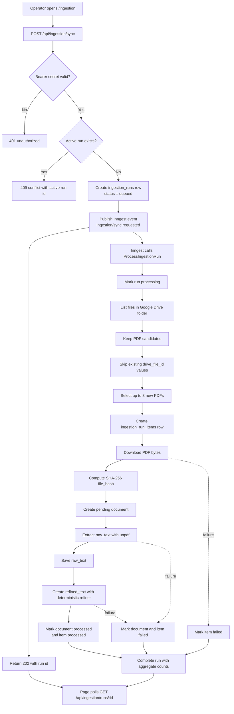

# M1 - Data Foundation and Ingestion

M1 established the governed data foundation for AIA Insight. The milestone turns PDF files stored in a fixed Google Drive folder into traceable Postgres records with extracted raw text, deterministic refined text, processing state, and ingestion-run history.

This milestone does not implement chunking, embeddings, retrieval, generation, XAI, or agents. Its purpose is to make documents ready for the future RAG pipeline while preserving governance and failure visibility from the first processing step.

## What Was Delivered

- A governed `documents` table with lifecycle status, Drive identity, origin, file hash, pipeline version, timestamps, raw text, refined text, nullable manual bibliographic fields, and safe failure information.
- Persistent ingestion run tracking through `ingestion_runs` and `ingestion_run_items`.
- An operator-facing `/ingestion` page in English to start a run and monitor progress.
- `POST /api/ingestion/sync` to create an ingestion run and enqueue background processing.
- `GET /api/ingestion/runs/:id` to poll run status and item-level results.
- `/api/inngest` to host the background ingestion function.
- Google Drive Service Account integration against a configured fixed folder.
- PDF selection rules that accept Drive files with MIME type `application/pdf` or names ending in `.pdf`.
- Existing-file skipping based on `documents.drive_file_id`.
- Batch limiting to at most 3 new PDFs per ingestion run.
- PDF download, SHA-256 hashing, governed pending document creation, text extraction, deterministic refinement, and final status transition.
- Per-document failure isolation so one failed PDF does not stop the rest of the selected batch.
- Safe error codes for operator/API visibility without leaking credentials, stack traces, raw provider errors, or private keys.
- Unit, component, route, repository, and integration coverage around the ingestion workflow.

## Technologies Used

| Area | Technology | Purpose |
|------|------------|---------|
| Web application | Next.js 15 App Router | UI and API routes |
| UI runtime | React 19 | Operator ingestion page |
| Language | TypeScript strict | Type safety across layers |
| Validation | Zod | Environment, route, event, and response contracts |
| Database | PostgreSQL with pgvector image locally | Governed document and ingestion-run persistence |
| ORM / migrations | Drizzle ORM and drizzle-kit | Schema definition, migrations, and typed persistence |
| Background processing | Inngest | Async ingestion execution outside the request path |
| Document source | Google Drive API via Service Account | Read-only access to the fixed PDF folder |
| PDF extraction | unpdf | Raw text extraction behind a `PdfExtractor` strategy |
| Hashing | Node crypto SHA-256 adapter | Governance file hash generation |
| Text refinement | Deterministic TypeScript refiner | Cleanup without LLM calls |
| Testing | Vitest, Testing Library, jsdom | Unit, integration, route, and UI tests |
| Local runtime | Docker Compose | Local Postgres setup |

## System Flow



## Runtime Behavior

The sync-start route is intentionally thin. It validates authorization, delegates run creation to the application layer, publishes an Inngest event, and returns immediately. The long-running work happens in the Inngest function.

The processing service owns the ingestion workflow:

1. Mark the run as `processing`.
2. List files from the configured Google Drive folder.
3. Filter PDF candidates.
4. Count existing documents by `drive_file_id` as skipped.
5. Select at most 3 new candidates.
6. For each selected PDF, create a run item and process it independently.
7. Download bytes, hash the file, and create a governed `pending` document.
8. Extract `raw_text` with the `unpdf` adapter.
9. Save `raw_text`.
10. Produce `refined_text` through deterministic cleanup.
11. Mark successful documents as `processed`.
12. Mark failed documents or items with safe error codes.
13. Complete the run with selected, processed, failed, and skipped-existing counts.

## Data Model Summary

`documents` is the governed record for each ingested Drive PDF. It stores the Drive file id, title from the Drive filename, origin, file hash, pipeline version, document status, raw text, refined text, and optional manual bibliographic metadata.

`ingestion_runs` stores the lifecycle of each operator-triggered run. It captures queued, processing, completed, and failed states, plus aggregate counts.

`ingestion_run_items` stores the per-selected-file result for a run. It links to a document when a governed document could be created, and remains inspectable even when processing fails.

## Important Rules Preserved

- Google Drive is the only document source in M1.
- Original PDFs remain in Google Drive; Postgres stores governance data and extracted/refined text.
- The initial title is the Drive filename.
- DOI, authors, publication year, notes, and similar bibliographic metadata remain manual and nullable.
- Duplicate content is not blocked by hash in M1.
- Existing Drive files already present in `documents.drive_file_id` are skipped, not updated.
- A document can become `processed` only after non-empty `raw_text` and `refined_text` are persisted.
- Failed documents remain inspectable and reprocessable by future features.
- Chunking in later milestones must read only `refined_text` from `processed` documents.
- M1 does not call LLMs or embedding providers.

## Local Operation

Use the local ingestion guide for hands-on setup:

```text
docs/local-ingestion.md
```

The usual local flow is:

```bash
pnpm install
pnpm dev:all
```

Then open:

```text
http://localhost:3000/ingestion
```

The Inngest Dev Server is available at:

```text
http://localhost:8288
```

## Verification

The M1 implementation is covered by tests across the domain, application, infrastructure adapters, repositories, API handlers, UI, and integration flow.

Before moving into the next milestone, the expected project checks are:

```bash
pnpm lint
pnpm typecheck
pnpm test
```
