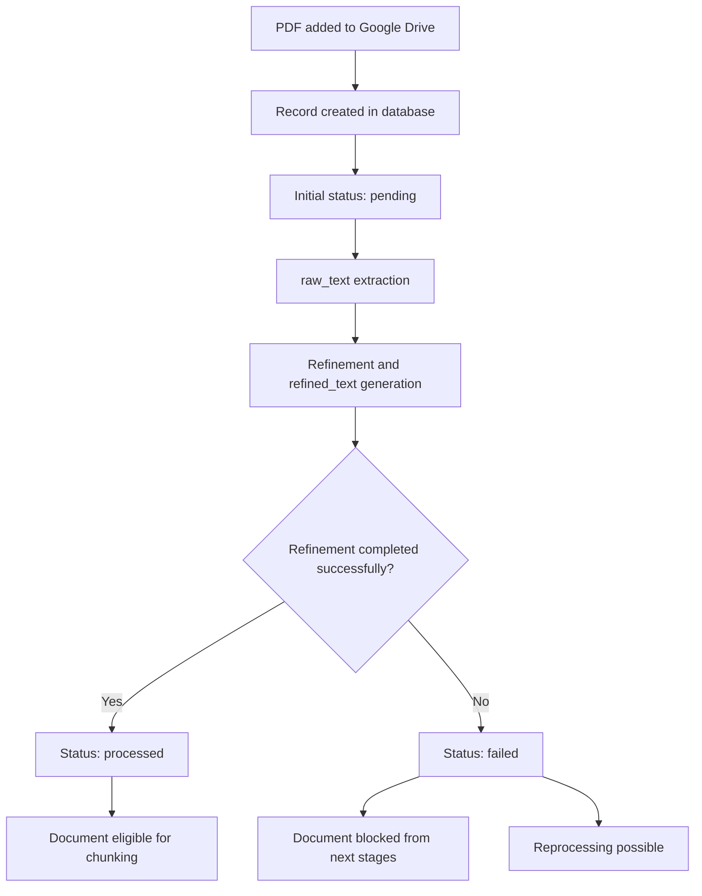

# Pipeline Operational Rules — Phase 1

## 1. Objective

This document consolidates the operational rules of the ingestion and document preparation pipeline in **Phase 1 — Data Structuring**.

The goal is to turn the conceptual definitions already established into practical operating rules, so that the implementation of document ingestion proceeds with less ambiguity and greater consistency.

---

## 2. Scope of this stage

Phase 1 covers:

- receiving the original PDF from Google Drive;
- registering the document in the relational database;
- generating and storing governance metadata;
- extracting the raw text (`raw_text`);
- generating the refined text (`refined_text`);
- preparing the document for later chunking.

This document does not yet address the RAG question-and-answer logic — only the data preparation and governance layer.

---

## 3. Document origin

Original documents will be stored in a dedicated folder in **Google Drive**, used as the source repository for the PDFs.

Authorized users may manually place files into that folder. The application is responsible for consuming those documents and registering them internally as governed entities.

---

## 4. Duplicate-handling rule

In this first version, the system **will not perform automatic duplicate handling**.

Control over repeated documents is the user's responsibility — the user decides manually which files are placed into the project repository.

This decision reduces initial complexity and is acceptable for the current scope of the application.

---

## 5. Rule for the document's initial title

At insertion time, the system will automatically fill the `title` field based on the **name of the file in Google Drive**.

The user therefore does not need to provide a title manually at the moment the document enters the system.

This initial title can be edited later by the user if they want to adjust the name shown in the application.

---

## 6. Optional fields filled manually

Some additional fields may be filled manually by the user after the document is initially created, for example:

- `doi`
- authors
- publication year
- other complementary notes

These values will not be inferred automatically in this phase.

---

## 7. Rule for DOI

The system **must not look up DOI automatically**.

If a DOI exists and is relevant, it must be entered manually by the user.

This keeps the flow simpler and avoids premature automation at the project's initial phase.

---

## 8. Automatic governance fields

Regardless of manual metadata entry, the system must automatically record governance elements whenever possible.

These include:

- internal document identifier;
- insertion date;
- last update date;
- document origin;
- reference to the file in Google Drive;
- file hash;
- processing status;
- logical document version.

These fields form the application's minimum traceability baseline.

---

## 9. Operational document flow

The minimum operational document flow in Phase 1 is:

1. the PDF is added to Google Drive;
2. the application detects or consumes the file;
3. a document record is created in the relational database;
4. the PDF text is extracted and saved as `raw_text`;
5. the content goes through cleaning and refinement;
6. the final result is saved as `refined_text`;
7. the document becomes eligible for the next stages.

---

## 10. Document states

The system uses a simplified state machine to represent the document's state during the pipeline.

### Valid states

- `pending`
- `processed`
- `failed`

### Meaning of each state

#### `pending`
The document has been ingested but is still being processed.

This state covers the window between the document's initial entry and the completion of the steps required for its textual preparation.

#### `processed`
The document has successfully completed the steps planned for Phase 1 and is ready to proceed to chunking and later stages.

#### `failed`
A failure occurred in some critical processing step, preventing the document from moving forward to the next stage.

---

## 11. Rule for status changes

### Initial entry
When the document enters the system, its initial status must be:

- `pending`

### Successful completion
When the document has:

- `raw_text` successfully extracted;
- `refined_text` successfully generated;

it may be marked as:

- `processed`

### Failure
If an error occurs at any critical step of the pipeline, the status must be changed to:

- `failed`

---

## 12. Criterion for the document to be ready for chunking

A document may only proceed to the chunking stage when the text refinement step has been completed.

In practice this means the document must have:

- `raw_text` available;
- `refined_text` available;
- status `processed`.

In other words, chunking operates exclusively on the **final refined text**.

---

## 13. Rule for text-refinement failure

If the text-refinement step fails:

- the document may not proceed to chunking;
- the status must be set to `failed`;
- the system must allow later reprocessing.

Refinement is considered a critical step, because `refined_text` is the defined basis for chunk generation in v1.

---

## 14. Reprocessing

Documents with status `failed` may be reprocessed later.

Reprocessing may happen, for example, when:

- a technical issue is fixed;
- the pipeline is adjusted;
- the user wants to retry text extraction or refinement.

A detailed reprocessing policy may be refined later, but the architecture must already allow this possibility.

---

## 15. General rule of Phase 1

The core logic of Phase 1 can be summarized as follows:

- the original PDF is preserved in Google Drive;
- the application creates a governed record of the document;
- the system generates `raw_text` and `refined_text`;
- only documents whose processing completed successfully move forward.

---

## 16. Summary diagram of the operational logic

---

## 17. Final synthesis

With these rules, the Phase 1 pipeline has clearer and more predictable behavior.

The key decisions of this stage are:

- do not handle duplicates automatically;
- fill the initial title automatically with the file name in Google Drive;
- allow later editing of the title by the user;
- do not look up DOI automatically;
- generate governance fields automatically;
- use only three operational states: `pending`, `processed`, and `failed`;
- consider the document ready for chunking only after `refined_text` has been generated.

This set of rules closes the minimum operational definition of Phase 1 and prepares the system for the technical implementation of the initial schema and the ingestion pipeline.
