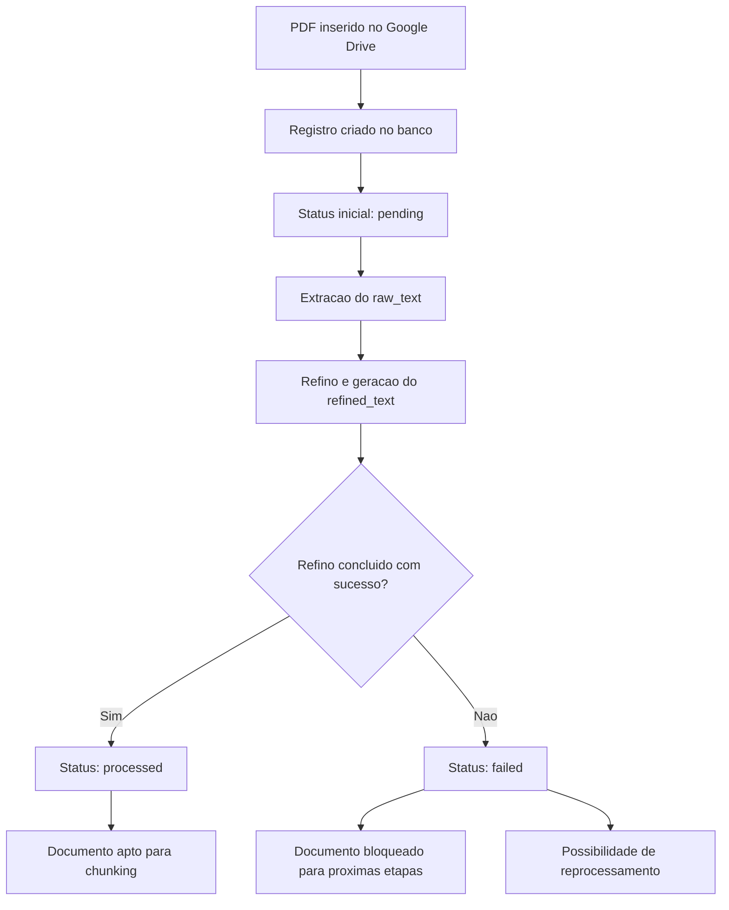

# Regras Operacionais da Pipeline — Fase 1

## 1. Objetivo

Este documento consolida as regras operacionais da pipeline de ingestão e preparação dos documentos na **Fase 1 — Estruturação dos Dados**.

O objetivo é transformar as definições conceituais já estabelecidas em regras práticas de funcionamento, de modo que a implementação da ingestão documental ocorra com menos ambiguidade e maior consistência.

---

## 2. Escopo desta etapa

A Fase 1 contempla:

- recebimento do PDF original a partir do Google Drive;
- registro do documento no banco relacional;
- geração e armazenamento de metadados de governança;
- extração do texto bruto (`raw_text`);
- geração do texto refinado (`refined_text`);
- preparação do documento para chunking posterior.

Este documento não trata ainda da lógica de perguntas e respostas do RAG, mas apenas da camada de preparação e governança dos dados.

---

## 3. Origem dos documentos

Os documentos originais serão armazenados em uma pasta específica do **Google Drive**, utilizada como repositório de origem dos PDFs.

Usuários autorizados poderão inserir manualmente os arquivos nessa pasta. A aplicação será responsável por consumir esses documentos e registrá-los internamente como entidades governadas.

---

## 4. Regra sobre duplicidade

Nesta primeira versão, o sistema **não realizará tratamento automático de duplicidade**.

O controle sobre documentos repetidos ficará sob responsabilidade do usuário, que terá controle manual sobre quais arquivos serão inseridos no repositório do projeto.

Essa decisão reduz complexidade inicial e é aceitável para o contexto atual da aplicação.

---

## 5. Regra para título inicial do documento

No momento da inserção, o sistema preencherá automaticamente o campo `title` com base no **nome do arquivo presente no Google Drive**.

Portanto, o usuário não precisará informar manualmente um título no momento inicial da entrada do documento no sistema.

Esse título inicial poderá ser alterado posteriormente pelo usuário, caso ele deseje ajustar o nome exibido na aplicação.

---

## 6. Campos opcionais preenchidos manualmente

Alguns campos adicionais poderão ser inseridos manualmente pelo usuário depois da criação inicial do documento, como por exemplo:

- `doi`
- autores
- ano de publicação
- outras observações complementares

Esses dados não serão inferidos automaticamente nesta fase.

---

## 7. Regra para DOI

O sistema **não deverá buscar DOI automaticamente**.

Caso o DOI exista e seja relevante, ele deverá ser inserido manualmente pelo usuário.

Essa decisão mantém o fluxo mais simples e evita automatizações prematuras na fase inicial do projeto.

---

## 8. Campos automáticos de governança

Independentemente do preenchimento manual dos metadados, o sistema deverá registrar automaticamente os elementos de governança sempre que possível.

Entre eles:

- identificador interno do documento;
- data de inserção;
- data de atualização;
- origem do documento;
- referência ao arquivo no Google Drive;
- hash do arquivo;
- status do processamento;
- versão lógica do documento.

Esses campos compõem a base mínima de rastreabilidade da aplicação.

---

## 9. Fluxo operacional do documento

O fluxo operacional mínimo do documento na Fase 1 será o seguinte:

1. o PDF é adicionado ao Google Drive;
2. a aplicação identifica ou consome o arquivo;
3. um registro do documento é criado no banco relacional;
4. o texto do PDF é extraído e salvo como `raw_text`;
5. o conteúdo passa por limpeza e refino;
6. o resultado final é salvo como `refined_text`;
7. o documento passa a estar apto para as etapas seguintes.

---

## 10. Estados do documento

O sistema utilizará uma máquina de estados simplificada para representar a situação do documento durante a pipeline.

### Estados válidos

- `pending`
- `processed`
- `failed`

### Significado de cada estado

#### `pending`
O documento foi inserido, mas ainda está em processamento.

Esse estado cobre o período entre a entrada inicial do documento e a conclusão das etapas necessárias para sua preparação textual.

#### `processed`
O documento concluiu com sucesso as etapas previstas na Fase 1 e está pronto para seguir para chunking e etapas posteriores.

#### `failed`
Houve falha em alguma etapa crítica do processamento, impedindo o avanço do documento para a etapa seguinte.

---

## 11. Regra para mudança de status

### Entrada inicial
Quando o documento entra no sistema, seu status inicial deve ser:

- `pending`

### Conclusão com sucesso
Quando o documento tiver:

- `raw_text` extraído com sucesso;
- `refined_text` gerado com sucesso;

ele poderá ser marcado como:

- `processed`

### Falha
Se ocorrer erro em alguma etapa crítica da pipeline, o status deve ser alterado para:

- `failed`

---

## 12. Critério para o documento ficar pronto para chunking

Um documento só poderá seguir para a etapa de chunking quando o processo de refinamento textual estiver concluído.

Na prática, isso significa que o documento precisa ter:

- `raw_text` disponível;
- `refined_text` disponível;
- status `processed`

Ou seja, o chunking será executado apenas sobre o **texto refinado final**.

---

## 13. Regra para falha no refino do texto

Se a etapa de refino do texto falhar:

- o documento não poderá seguir para chunking;
- o status deverá ser marcado como `failed`;
- o sistema deverá permitir reprocessamento posterior.

O refinamento é considerado etapa crítica, pois o `refined_text` é a base definida para geração dos chunks na V1.

---

## 14. Reprocessamento

Documentos com status `failed` poderão ser reprocessados posteriormente.

Esse reprocessamento poderá ocorrer, por exemplo, quando:

- houver correção de algum problema técnico;
- houver ajuste no pipeline;
- o usuário desejar tentar novamente a extração ou o refino do texto.

A política detalhada de reprocessamento poderá ser refinada futuramente, mas a arquitetura já deve permitir essa possibilidade.

---

## 15. Regra geral da Fase 1

A lógica principal da Fase 1 pode ser resumida da seguinte forma:

- o PDF original é preservado no Google Drive;
- a aplicação cria um registro governado do documento;
- o sistema gera `raw_text` e `refined_text`;
- apenas documentos com processamento concluído com sucesso seguem adiante.

---

## 16. Diagrama resumido da lógica operacional

---

## 17. Síntese final

Com estas regras, a pipeline da Fase 1 passa a ter comportamento mais claro e previsível.

As decisões principais desta etapa são:

- não tratar duplicidade automaticamente;
- preencher o título inicial automaticamente com o nome do arquivo no Google Drive;
- permitir edição posterior do título pelo usuário;
- não buscar DOI automaticamente;
- gerar automaticamente os campos de governança;
- utilizar apenas três estados operacionais: `pending`, `processed` e `failed`;
- considerar o documento apto para chunking apenas após a geração do `refined_text`.

Esse conjunto de regras encerra a definição operacional mínima da Fase 1 e prepara o sistema para a implementação técnica do schema inicial e da pipeline de ingestão.
